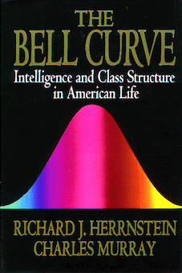

===================
第三章 ABM建模基础
===================

`ABM释义 <https://zh.wikipedia.org/wiki/%E4%B8%AA%E4%BD%93%E4%B8%BA%E6%9C%AC%E6%A8%A1%E5%9E%8B>`_

ABM(Agent Based Modeling)与EBM(Equation Based Modeling)这两种建模方式受不同的人群与场景欢迎。比如在经济学研究中，早期EBM为主，随着ABM的流行有部分人则尝试使用它，但不是说有它就足够了。《ABM in Economy》这本书做了一个很好的示例，ABM结合EBM去研究模型，即EBM作为ABM的理论支撑，使用ABM予以表现模型，从而利于解释与预测一个现象或者模型。

----------------
3.1 建模的种类
----------------

Agent Based Modeling的历史严格来说并不算太久，很多论文中我们都可以看到它是近几十年才成型的建模方法。

---------------------
3.2 经济学JEL分类
---------------------

https://www.aeaweb.org/econlit/jelCodes.php?view=jel

-------------
3.3 建模方法
-------------

3.3.1. ABM建模
================

3.3.2. EBM建模
===============

EBM不是这本书的重点，但并不是说它不重要，因为已经有很多书去介绍了，这里仅仅

-------------
3.4 建模思考
-------------

处理问题的方法。

-------------
3.5 模型收集
-------------

**Auction**

Auction theory is an applied branch of economics which deals with how people act in auction markets and researches the properties of auction markets. There are many possible designs (or sets of rules) for an auction and typical issues studied by auction theorists include the efficiency of a given auction design, optimal and equilibrium bidding strategies, and revenue comparison. Auction theory is also used as a tool to inform the design of real-world auctions; most notably auctions for the privatization of public-sector companies or the sale of licenses for use of the electromagnetic spectrum.

General idea
Auctions are characterized as transactions with a specific set of rules detailing resource allocation according to participants' bids. They are categorized as games with incomplete information because in the vast majority of auctions, one party will possess information related to the transaction that the other party does not (e.g., the bidders usually know their personal valuation of the item, which is unknown to the other bidders and the seller).[1] Auctions take many forms, but they share the characteristic that they are universal and can be used to sell or buy any item. In many cases, the outcome of the auction does not depend on the identity of the bidders (i.e., auctions are anonymous).

Most auctions have the feature that participants submit bids, amounts of money they are willing to pay. Standard auctions require that the winner of the auction is the participant with the highest bid. A nonstandard auction does not require this (e.g., a lottery).

Types of auction
Main article: Auction § Types
There are traditionally four types of auction that are used for the allocation of a single item:

First-price sealed-bid auctions in which bidders place their bid in a sealed envelope and simultaneously hand them to the auctioneer. The envelopes are opened and the individual with the highest bid wins, paying the amount bid.
Second-price sealed-bid auctions (Vickrey auctions) in which bidders place their bid in a sealed envelope and simultaneously hand them to the auctioneer. The envelopes are opened and the individual with the highest bid wins, paying a price equal to the second-highest bid.
Open ascending-bid auctions (English auctions) in which participants make increasingly higher bids, each stopping bidding when they are not prepared to pay more than the current highest bid. This continues until no participant is prepared to make a higher bid; the highest bidder wins the auction at the final amount bid. Sometimes the lot is only actually sold if the bidding reaches a reserve price set by the seller.
Open descending-bid auctions (Dutch auctions) in which the price is set by the auctioneer at a level sufficiently high to deter all bidders, and is progressively lowered until a bidder is prepared to buy at the current price, winning the auction.
Most auction theory revolves around these four "basic" auction types. However, other auction types have also received some academic study (see Auction Types).

Benchmark model
The benchmark model for auctions, as defined by McAfee and McMillan (1987), offers a generalization of auction formats, and is based on four assumptions:

All of the bidders are risk-neutral.
Each bidder has a private valuation for the item independently drawn from some probability distribution.
The bidders possess symmetric information.
The payment is represented as a function of only the bids.
The benchmark model is often used in tandem with the Revelation Principle, which states that each of the basic auction types is structured such that each bidder has incentive to report their valuation honestly. The two are primarily used by sellers to determine the auction type that maximizes the expected price. This optimal auction format is defined such that the item will be offered to the bidder with the highest valuation at a price equal to their valuation, but the seller will refuse to sell the item if they expect that all of the bidders' valuations of the item are less than their own.[1]

Relaxing each of the four main assumptions of the benchmark model yields auction formats with unique characteristics:

Risk-averse bidders incur some kind of cost from participating in risky behaviors, which affects their valuation of a product. In sealed-bid first-price auctions, risk-averse bidders are more willing to bid more to increase their probability of winning, which, in turn, increases their expected utility. This allows sealed-bid first-price auctions to produce higher expected revenue than English and sealed-bid second-price auctions.
In formats with correlated values—where the bidders’ values for the item are not independent—one of the bidders perceiving their value of the item to be high makes it more likely that the other bidders will perceive their own values to be high. A notable example of this instance is the Winner’s curse, where the results of the auction convey to the winner that everyone else estimated the value of the item to be less than they did. Additionally, the linkage principle allows revenue comparisons amongst a fairly general class of auctions with interdependence between bidders' values.
The asymmetric model assumes that bidders are separated into two classes that draw valuations from different distributions (i.e., dealers and collectors in an antiques auction).
In formats with royalties or incentive payments, the seller incorporates additional factors, especially those that affect the true value of the item (e.g., supply, production costs, and royalty payments), into the price function.[1]
Game-theoretic models
A game-theoretic auction model is a mathematical game represented by a set of players, a set of actions (strategies) available to each player, and a payoff vector corresponding to each combination of strategies. Generally, the players are the buyer(s) and the seller(s). The action set of each player is a set of bid functions or reservation prices (reserves). Each bid function maps the player's value (in the case of a buyer) or cost (in the case of a seller) to a bid price. The payoff of each player under a combination of strategies is the expected utility (or expected profit) of that player under that combination of strategies.

Game-theoretic models of auctions and strategic bidding generally fall into either of the following two categories. In a private value model, each participant (bidder) assumes that each of the competing bidders obtains a random private value from a probability distribution. In a common value model, the participants have equal valuations of the item, but they do not have perfectly accurate information about this valuation. In lieu of knowing the exact valuation of the item, each participant can assume that any other participant obtains a random signal, which can be used to estimate the true valuation, from a probability distribution common to all bidders.[2] Usually, but not always, a private values model assumes that the values are independent across bidders, whereas a common value model usually assumes that the values are independent up to the common parameters of the probability distribution.

A more general category for strategic bidding is the affiliated values model, in which the bidder's total utility depends on both their individual private signal and some unknown common value. Both the private value and common value models can be perceived as extensions of the general affiliated values model.[3]

Ex-post equilibrium in a simple auction market.
When it is necessary to make explicit assumptions about bidders' value distributions, most of the published research assumes symmetric bidders. This means that the probability distribution from which the bidders obtain their values (or signals) is identical across bidders. In a private values model which assumes independence, symmetry implies that the bidders' values are independently and identically distributed (i.i.d.).

An important example (which does not assume independence) is Milgrom and Weber's "general symmetric model" (1982).[4][5] One of the earlier published theoretical research addressing properties of auctions among asymmetric bidders is Keith Waehrer's 1999 article.[6] Later published research include Susan Athey's 2001 Econometrica article,[7] as well as Reny and Zamir (2004).[8]

The first formal analysis of auctions was by William Vickrey (1961). Vickrey considers two buyers bidding for a single item. Each buyer's value, v, is an independent draw from a uniform distribution with support [0,1]. Vickrey showed that in the sealed first-price auction it is an equilibrium bidding strategy for each bidder to bid half his valuation. With more bidders, all drawing a value from the same uniform distribution it is easy to show that the symmetric equilibrium bidding strategy is

.. math::

    B(v)=\left(\frac{n-1}{n}\right)v

**Automata**

Automata(or Automaton), is a self-operating machine, or a machine or control mechanism designed to automatically follow a predetermined sequence of operations, or respond to predetermined instructions. Some automata, such as bellstrikers in mechanical clocks, are designed to give the illusion to the casual observer that they are operating under their own power.

One of the most famous is "A new kind of science" by Stephen Wolfram(founder of Wolfram Research Inc.). The writer researched lots patterns of cellular automata.

.. image:: ../images/Gospers_glider_gun.gif
    :align: center

**Bell Curves**

The Bell Curve: Intelligence and Class Structure in American Life is a 1994 book by psychologist Richard J. Herrnstein and political scientist Charles Murray, in which the authors argue that human intelligence is substantially influenced by both inherited and environmental factors and that it is a better predictor of many personal dynamics, including financial income, job performance, birth out of wedlock, and involvement in crime than are an individual's parental socioeconomic status. They also argue that those with high intelligence, the "cognitive elite", are becoming separated from those of average and below-average intelligence. The book was controversial, especially where the authors wrote about racial differences in intelligence and discussed the implications of those differences.

Shortly after its publication, many people rallied both in criticism and defense of the book. A number of critical texts were written in response to it.

**Collective Coorperation**

**DIKW**

**Entropy**

**Fisher**

**Large Event**

**Linear**

**Long tails**

**Lyapunov**

**Marknov**

**Miller Page**

**Nash Equilibrium**

**Networks**

**Percolation**

**Polya Balancing Process**

**Prisoner Dilemma**

**RandomWalking**

**Risk in tails**

**S Concurve Convex**

**Schellings**

**Shapley Value**

**Six Sigma**

**Spatial**

**Tipping Point**

**Uncertainty**

**Voter**

**EACH**

---------------------
3.6 NetLogo模型全解
---------------------

.. code::

	├── 3D
	│   ├── Code Examples
	│   │   ├── Airplane Landing Example 3D.nlogo3d
	│   │   ├── Airplane Landing Example 3D.png
	│   │   ├── Bouncing Balls Example 3D.nlogo3d
	│   │   ├── Bouncing Balls Example 3D.png
	│   │   ├── Hill Climbing Example 3D.nlogo3d
	│   │   ├── Hill Climbing Example 3D.png
	│   │   ├── Neighborhoods Example 3D.nlogo3d
	│   │   ├── Neighborhoods Example 3D.png
	│   │   ├── Network Example 3D.nlogo3d
	│   │   ├── Network Example 3D.png
	│   │   ├── Shapes Example 3D.nlogo3d
	│   │   ├── Shapes Example 3D.png
	│   │   ├── Spherical Path Example 3D.nlogo3d
	│   │   ├── Spherical Path Example 3D.png
	│   │   ├── Three Loops Example 3D.nlogo3d
	│   │   ├── Three Loops Example 3D.png
	│   │   ├── Trails Example 3D.nlogo3d
	│   │   ├── Trails Example 3D.png
	│   │   ├── Turtle Dance Example 3D.nlogo3d
	│   │   ├── Turtle Dance Example 3D.png
	│   │   ├── Turtle Perspective Example 3D.nlogo3d
	│   │   ├── Turtle Perspective Example 3D.png
	│   │   ├── Turtle and Observer Motion Example 3D.nlogo3d
	│   │   ├── Turtle and Observer Motion Example 3D.png
	│   │   ├── Uniform Distribution on a Sphere Example 3D.nlogo3d
	│   │   └── Uniform Distribution on a Sphere Example 3D.png
	│   └── Sample Models
	│       ├── DLA 3D.nlogo3d
	│       ├── DLA 3D.png
	│       ├── Fireworks 3D.nlogo3d
	│       ├── Fireworks 3D.png
	│       ├── Flocking 3D Alternate.nlogo3d
	│       ├── Flocking 3D Alternate.png
	│       ├── Flocking 3D.nlogo3d
	│       ├── Flocking 3D.png
	│       ├── Follower 3D.nlogo3d
	│       ├── Follower 3D.png
	│       ├── GasLab
	│       │   ├── GasLab Free Gas 3D.nlogo3d
	│       │   ├── GasLab Free Gas 3D.png
	│       │   ├── GasLab Single Collision 3D.nlogo3d
	│       │   ├── GasLab Single Collision 3D.png
	│       │   ├── GasLab Two Gas 3D.nlogo3d
	│       │   ├── GasLab Two Gas 3D.png
	│       │   └── wall.txt
	│       ├── Hydrogen Diffusion 3D.nlogo3d
	│       ├── Hydrogen Diffusion 3D.png
	│       ├── Life 3D.nlogo3d
	│       ├── Life 3D.png
	│       ├── Mousetraps 3D.nlogo3d
	│       ├── Mousetraps 3D.png
	│       ├── Percolation 3D.nlogo3d
	│       ├── Percolation 3D.png
	│       ├── Preferential Attachment 3D.nlogo3d
	│       ├── Preferential Attachment 3D.png
	│       ├── Raindrops 3D.nlogo3d
	│       ├── Raindrops 3D.png
	│       ├── Rope 3D.nlogo3d
	│       ├── Rope 3D.png
	│       ├── Sand 3D.nlogo3d
	│       ├── Sand 3D.png
	│       ├── Sandpile 3D.nlogo3d
	│       ├── Sandpile 3D.png
	│       ├── Sierpinski Simple 3D.nlogo3d
	│       ├── Sierpinski Simple 3D.png
	│       ├── Sunflower 3D.nlogo3d
	│       ├── Sunflower 3D.png
	│       ├── Surface Walking 3D.nlogo3d
	│       ├── Surface Walking 3D.png
	│       ├── Termites 3D.nlogo3d
	│       ├── Termites 3D.png
	│       ├── Tree Simple 3D.nlogo3d
	│       ├── Tree Simple 3D.png
	│       ├── Wave Machine 3D.nlogo3d
	│       └── Wave Machine 3D.png
	├── Alternative Visualizations
	│   ├── Ethnocentrism - Alternative Visualization.nlogo
	│   ├── Ethnocentrism - Alternative Visualization.png
	│   ├── Flocking - Alternative Visualizations.nlogo
	│   ├── Flocking - Alternative Visualizations.png
	│   ├── Heat Diffusion - Alternative Visualization.nlogo
	│   ├── Heat Diffusion - Alternative Visualization.png
	│   ├── Virus - Alternative Visualization.nlogo
	│   ├── Virus - Alternative Visualization.png
	│   ├── Virus - Circle Visualization.nlogo
	│   └── Virus - Circle Visualization.png
	├── Code Examples
	│   ├── 3D Shapes Example.nlogo
	│   ├── 3D Shapes Example.png
	│   ├── Ask Ordering Example.nlogo
	│   ├── Ask Ordering Example.png
	│   ├── Ask-Concurrent Example.nlogo
	│   ├── Ask-Concurrent Example.png
	│   ├── Bounce Example.nlogo
	│   ├── Bounce Example.png
	│   ├── Box Drawing Example.nlogo
	│   ├── Box Drawing Example.png
	│   ├── Breed Procedures Example.nlogo
	│   ├── Breed Procedures Example.png
	│   ├── Breeds and Shapes Example.nlogo
	│   ├── Breeds and Shapes Example.png
	│   ├── Case Conversion Example.nlogo
	│   ├── Case Conversion Example.png
	│   ├── Circular Path Example.nlogo
	│   ├── Circular Path Example.png
	│   ├── Color Chart Example.nlogo
	│   ├── Color Chart Example.png
	│   ├── Communication-T-P Example.nlogo
	│   ├── Communication-T-P Example.png
	│   ├── Communication-T-T Example.nlogo
	│   ├── Communication-T-T Example.png
	│   ├── Diffuse Off Edges Example.nlogo
	│   ├── Diffuse Off Edges Example.png
	│   ├── Extensions Examples
	│   │   ├── csv
	│   │   │   ├── CSV Example.nlogo
	│   │   │   └── CSV Example.png
	│   │   ├── gis
	│   │   │   ├── GIS General Examples.nlogo
	│   │   │   ├── GIS General Examples.png
	│   │   │   ├── GIS Gradient Example.nlogo
	│   │   │   ├── GIS Gradient Example.png
	│   │   │   └── data
	│   │   │       ├── Lambert_Conformal_Conic.prj
	│   │   │       ├── US_Orthographic.prj
	│   │   │       ├── WGS_84_Geographic.prj
	│   │   │       ├── cities.dbf
	│   │   │       ├── cities.prj
	│   │   │       ├── cities.shp
	│   │   │       ├── cities.shx
	│   │   │       ├── cities.txt
	│   │   │       ├── countries.dbf
	│   │   │       ├── countries.prj
	│   │   │       ├── countries.shp
	│   │   │       ├── countries.shx
	│   │   │       ├── countries.xml
	│   │   │       ├── local-elevation.asc
	│   │   │       ├── local-elevation.prj
	│   │   │       ├── rivers.dbf
	│   │   │       ├── rivers.prj
	│   │   │       ├── rivers.shp
	│   │   │       ├── rivers.shx
	│   │   │       ├── rivers.txt
	│   │   │       ├── world-elevation.asc
	│   │   │       └── world-elevation.prj
	│   │   ├── gogo
	│   │   │   ├── GoGoMonitor.nlogo
	│   │   │   ├── GoGoMonitor.png
	│   │   │   ├── GoGoMonitorSimple.nlogo
	│   │   │   └── GoGoMonitorSimple.png
	│   │   ├── ls
	│   │   │   ├── Model Interactions Example.nlogo
	│   │   │   ├── Model Interactions Example.png
	│   │   │   ├── Model Visualizer and Plotter Example.nlogo
	│   │   │   ├── Model Visualizer and Plotter Example.png
	│   │   │   ├── Parent Model Example.nlogo
	│   │   │   └── Parent Model Example.png
	│   │   ├── matrix
	│   │   │   ├── Matrix Example.nlogo
	│   │   │   └── Matrix Example.png
	│   │   ├── nw
	│   │   │   ├── NW General Examples.nlogo
	│   │   │   └── NW General Examples.png
	│   │   ├── palette
	│   │   │   ├── Palette Example.nlogo
	│   │   │   └── Palette Example.png
	│   │   ├── profiler
	│   │   │   ├── Profiler Example.nlogo
	│   │   │   └── Profiler Example.png
	│   │   ├── rnd
	│   │   │   ├── Rnd Example.nlogo
	│   │   │   └── Rnd Example.png
	│   │   ├── sound
	│   │   │   ├── Beatbox.nlogo
	│   │   │   ├── Beatbox.png
	│   │   │   ├── Beats
	│   │   │   │   ├── rock1.csv
	│   │   │   │   ├── seth1.csv
	│   │   │   │   ├── seth2.csv
	│   │   │   │   └── seth3.csv
	│   │   │   ├── Composer.nlogo
	│   │   │   ├── Composer.png
	│   │   │   ├── GasLab With Sound.nlogo
	│   │   │   ├── GasLab With Sound.png
	│   │   │   ├── Musical Phrase Example.nlogo
	│   │   │   ├── Musical Phrase Example.png
	│   │   │   ├── Percussion Workbench.nlogo
	│   │   │   ├── Percussion Workbench.png
	│   │   │   ├── Sound Workbench.nlogo
	│   │   │   └── Sound Workbench.png
	│   │   ├── table
	│   │   │   ├── Table Example.nlogo
	│   │   │   └── Table Example.png
	│   │   ├── vid
	│   │   │   ├── Movie Playing Example.nlogo
	│   │   │   ├── Movie Playing Example.png
	│   │   │   ├── Movie Recording Example.nlogo
	│   │   │   ├── Movie Recording Example.png
	│   │   │   ├── Video Camera Example.nlogo
	│   │   │   └── Video Camera Example.png
	│   │   └── view2.5d
	│   │       ├── 2.5d Patch View Example.nlogo
	│   │       └── 2.5d Patch View Example.png
	│   ├── File IO Patch Data.txt
	│   ├── File Input Example.nlogo
	│   ├── File Input Example.png
	│   ├── File Output Example.nlogo
	│   ├── File Output Example.png
	│   ├── Fully Connected Network Example.nlogo
	│   ├── Fully Connected Network Example.png
	│   ├── Grouping Turtles Example.nlogo
	│   ├── Grouping Turtles Example.png
	│   ├── HSB and RGB Example.nlogo
	│   ├── HSB and RGB Example.png
	│   ├── Halo Example.nlogo
	│   ├── Halo Example.png
	│   ├── Hatch Example.nlogo
	│   ├── Hatch Example.png
	│   ├── Hex Cells Example.nlogo
	│   ├── Hex Cells Example.png
	│   ├── Hex Turtles Example.nlogo
	│   ├── Hex Turtles Example.png
	│   ├── Hill Climbing Example.nlogo
	│   ├── Hill Climbing Example.png
	│   ├── Histogram Example.nlogo
	│   ├── Histogram Example.png
	│   ├── Image Import Example.nlogo
	│   ├── Image Import Example.png
	│   ├── Info Tab Example.nlogo
	│   ├── Info Tab Example.png
	│   ├── Intersecting Lines Example.nlogo
	│   ├── Intersecting Lines Example.png
	│   ├── Intersecting Links Example.nlogo
	│   ├── Intersecting Links Example.png
	│   ├── Label Position Example.nlogo
	│   ├── Label Position Example.png
	│   ├── Lattice-Walking Turtles Example.nlogo
	│   ├── Lattice-Walking Turtles Example.png
	│   ├── Line of Sight Example.nlogo
	│   ├── Line of Sight Example.png
	│   ├── Link Breeds Example.nlogo
	│   ├── Link Breeds Example.png
	│   ├── Link Lattice Example.nlogo
	│   ├── Link Lattice Example.png
	│   ├── Link-Walking Turtles Example.nlogo
	│   ├── Link-Walking Turtles Example.png
	│   ├── Look Ahead Example.nlogo
	│   ├── Look Ahead Example.png
	│   ├── Lottery Example.nlogo
	│   ├── Lottery Example.png
	│   ├── Many Regions Example.nlogo
	│   ├── Many Regions Example.png
	│   ├── Mobile Aggregation Example.nlogo
	│   ├── Mobile Aggregation Example.png
	│   ├── Moore & Von Neumann Example.nlogo
	│   ├── Moore & Von Neumann Example.png
	│   ├── Mouse Drag Multiple Example.nlogo
	│   ├── Mouse Drag Multiple Example.png
	│   ├── Mouse Drag One Example.nlogo
	│   ├── Mouse Drag One Example.png
	│   ├── Mouse Example.nlogo
	│   ├── Mouse Example.png
	│   ├── Mouse Recording Example.nlogo
	│   ├── Mouse Recording Example.png
	│   ├── Move Towards Target Example.nlogo
	│   ├── Move Towards Target Example.png
	│   ├── Myself Example.nlogo
	│   ├── Myself Example.png
	│   ├── Neighborhoods Example.nlogo
	│   ├── Neighborhoods Example.png
	│   ├── Network Example.nlogo
	│   ├── Network Example.png
	│   ├── Network Import Example.nlogo
	│   ├── Network Import Example.png
	│   ├── Next Patch Example.nlogo
	│   ├── Next Patch Example.png
	│   ├── One Turtle Per Patch Example.nlogo
	│   ├── One Turtle Per Patch Example.png
	│   ├── Partners Example.nlogo
	│   ├── Partners Example.png
	│   ├── Patch Clusters Example.nlogo
	│   ├── Patch Clusters Example.png
	│   ├── Patch Coordinates Example.nlogo
	│   ├── Patch Coordinates Example.png
	│   ├── Perspective Demos
	│   │   ├── Ants (Perspective Demo).nlogo
	│   │   ├── Ants (Perspective Demo).png
	│   │   ├── Flocking (Perspective Demo).nlogo
	│   │   ├── Flocking (Perspective Demo).png
	│   │   ├── GasLab Gas in a Box (Perspective Demo).nlogo
	│   │   ├── GasLab Gas in a Box (Perspective Demo).png
	│   │   ├── Termites (Perspective Demo).nlogo
	│   │   └── Termites (Perspective Demo).png
	│   ├── Perspective Example.nlogo
	│   ├── Perspective Example.png
	│   ├── Plot Axis Example.nlogo
	│   ├── Plot Axis Example.png
	│   ├── Plot Smoothing Example.nlogo
	│   ├── Plot Smoothing Example.png
	│   ├── Plotting Example.nlogo
	│   ├── Plotting Example.png
	│   ├── Random Grid Walk Example.nlogo
	│   ├── Random Grid Walk Example.png
	│   ├── Random Network Example.nlogo
	│   ├── Random Network Example.png
	│   ├── Random Seed Example.nlogo
	│   ├── Random Seed Example.png
	│   ├── Random Walk Example.nlogo
	│   ├── Random Walk Example.png
	│   ├── Rolling Plot Example.nlogo
	│   ├── Rolling Plot Example.png
	│   ├── Scale-color Example.nlogo
	│   ├── Scale-color Example.png
	│   ├── Scatter Example.nlogo
	│   ├── Scatter Example.png
	│   ├── Shape Animation Example.nlogo
	│   ├── Shape Animation Example.png
	│   ├── State Machine Example.nlogo
	│   ├── State Machine Example.png
	│   ├── Tie System Example.nlogo
	│   ├── Tie System Example.png
	│   ├── Transparency Example.nlogo
	│   ├── Transparency Example.png
	│   ├── Tutorial 3.nlogo
	│   ├── Tutorial 3.png
	│   ├── User Interaction Example.nlogo
	│   ├── User Interaction Example.png
	│   ├── Vision Cone Example.nlogo
	│   ├── Vision Cone Example.png
	│   ├── Wall Following Example.nlogo
	│   ├── Wall Following Example.png
	│   ├── aquifer-egypt.jpg
	│   ├── attributes.txt
	│   ├── dandelions.gif
	│   ├── earth.gif
	│   ├── ecoli.jpg
	│   ├── links.txt
	│   └── weathermap.jpg
	├── Curricular Models
	│   ├── BEAGLE Evolution
	│   │   ├── Bird Breeder.nlogo
	│   │   ├── Bird Breeder.png
	│   │   ├── Bug Hunt Coevolution.nlogo
	│   │   ├── Bug Hunt Coevolution.png
	│   │   ├── Bug Hunt Consumers.nlogo
	│   │   ├── Bug Hunt Consumers.png
	│   │   ├── Bug Hunt Drift.nlogo
	│   │   ├── Bug Hunt Drift.png
	│   │   ├── Bug Hunt Predators and Invasive Species.nlogo
	│   │   ├── Bug Hunt Predators and Invasive Species.png
	│   │   ├── DNA Protein Synthesis.nlogo
	│   │   ├── DNA Protein Synthesis.png
	│   │   ├── DNA Replication Fork.nlogo
	│   │   ├── DNA Replication Fork.png
	│   │   ├── Fish Tank Genetic Drift.nlogo
	│   │   ├── Fish Tank Genetic Drift.png
	│   │   ├── HubNet Activities
	│   │   │   ├── Bird Breeders HubNet.nlogo
	│   │   │   ├── Bird Breeders HubNet.png
	│   │   │   ├── Bug Hunters Competition HubNet.nlogo
	│   │   │   ├── Bug Hunters Competition HubNet.png
	│   │   │   ├── Critter Designers HubNet.nlogo
	│   │   │   ├── Critter Designers HubNet.png
	│   │   │   ├── Fish Spotters HubNet.nlogo
	│   │   │   └── Fish Spotters HubNet.png
	│   │   ├── Plant Hybridization.nlogo
	│   │   ├── Plant Hybridization.png
	│   │   ├── Plant Speciation.nlogo
	│   │   ├── Plant Speciation.png
	│   │   ├── Red Queen.nlogo
	│   │   └── Red Queen.png
	│   ├── Connected Chemistry
	│   │   ├── Connected Chemistry 1 Bike Tire.nlogo
	│   │   ├── Connected Chemistry 1 Bike Tire.png
	│   │   ├── Connected Chemistry 2 Changing Pressure.nlogo
	│   │   ├── Connected Chemistry 2 Changing Pressure.png
	│   │   ├── Connected Chemistry 3 Circular Particles.nlogo
	│   │   ├── Connected Chemistry 3 Circular Particles.png
	│   │   ├── Connected Chemistry 4 Number and Pressure.nlogo
	│   │   ├── Connected Chemistry 4 Number and Pressure.png
	│   │   ├── Connected Chemistry 5 Temperature and Pressure.nlogo
	│   │   ├── Connected Chemistry 5 Temperature and Pressure.png
	│   │   ├── Connected Chemistry 6 Volume and Pressure.nlogo
	│   │   ├── Connected Chemistry 6 Volume and Pressure.png
	│   │   ├── Connected Chemistry 7 Ideal Gas Law.nlogo
	│   │   ├── Connected Chemistry 7 Ideal Gas Law.png
	│   │   ├── Connected Chemistry 8 Gas Particle Sandbox.nlogo
	│   │   ├── Connected Chemistry 8 Gas Particle Sandbox.png
	│   │   ├── Connected Chemistry Atmosphere.nlogo
	│   │   ├── Connected Chemistry Atmosphere.png
	│   │   ├── Connected Chemistry Gas Combustion.nlogo
	│   │   ├── Connected Chemistry Gas Combustion.png
	│   │   ├── Connected Chemistry Reversible Reaction.nlogo
	│   │   ├── Connected Chemistry Reversible Reaction.png
	│   │   ├── Connected Chemistry Rusting Reaction.nlogo
	│   │   ├── Connected Chemistry Rusting Reaction.png
	│   │   ├── Connected Chemistry Solid Combustion.nlogo
	│   │   └── Connected Chemistry Solid Combustion.png
	│   ├── GenEvo
	│   │   ├── GenEvo 1 Genetic Switch.nlogo
	│   │   ├── GenEvo 1 Genetic Switch.png
	│   │   ├── GenEvo 2 Genetic Drift.nlogo
	│   │   ├── GenEvo 2 Genetic Drift.png
	│   │   ├── GenEvo 3 Genetic Drift and Natural Selection.nlogo
	│   │   ├── GenEvo 3 Genetic Drift and Natural Selection.png
	│   │   ├── GenEvo 4 Competition.nlogo
	│   │   ├── GenEvo 4 Competition.png
	│   │   ├── Synthetic Biology - Genetic Switch.nlogo
	│   │   └── Synthetic Biology - Genetic Switch.png
	│   ├── Lattice Land
	│   │   ├── Lattice Land - Explore.nlogo
	│   │   ├── Lattice Land - Explore.png
	│   │   ├── Lattice Land - Triangles Dissection.nlogo
	│   │   ├── Lattice Land - Triangles Dissection.png
	│   │   ├── Lattice Land - Triangles Explore.nlogo
	│   │   └── Lattice Land - Triangles Explore.png
	│   ├── ModelSim
	│   │   ├── Evolution
	│   │   │   ├── Bacteria Food Hunt.nlogo
	│   │   │   ├── Bacteria Food Hunt.png
	│   │   │   ├── Bacteria Hunt Speeds.nlogo
	│   │   │   └── Bacteria Hunt Speeds.png
	│   │   └── Population Biology
	│   │       ├── Bug Hunt Disruptions.nlogo
	│   │       ├── Bug Hunt Disruptions.png
	│   │       ├── Bug Hunt Environmental Changes.nlogo
	│   │       ├── Bug Hunt Environmental Changes.png
	│   │       ├── Bug Hunt Predators and Invasive Species - Two Regions.nlogo
	│   │       └── Bug Hunt Predators and Invasive Species - Two Regions.png
	│   ├── NIELS
	│   │   ├── Current in a Wire.nlogo
	│   │   ├── Current in a Wire.png
	│   │   ├── Electron Sink.nlogo
	│   │   ├── Electron Sink.png
	│   │   ├── Electrostatics.nlogo
	│   │   ├── Electrostatics.png
	│   │   ├── Parallel Circuit.nlogo
	│   │   ├── Parallel Circuit.png
	│   │   ├── Series Circuit.nlogo
	│   │   └── Series Circuit.png
	│   ├── ProbLab
	│   │   ├── 4 Block Stalagmites.nlogo
	│   │   ├── 4 Block Stalagmites.png
	│   │   ├── 4 Block Two Stalagmites.nlogo
	│   │   ├── 4 Block Two Stalagmites.png
	│   │   ├── 4 Blocks.nlogo
	│   │   ├── 4 Blocks.png
	│   │   ├── Histo Blocks.nlogo
	│   │   ├── Histo Blocks.png
	│   │   ├── Sampler Solo.nlogo
	│   │   └── Sampler Solo.png
	│   ├── Urban Suite
	│   │   ├── Urban Suite - Awareness.nlogo
	│   │   ├── Urban Suite - Awareness.png
	│   │   ├── Urban Suite - Cells.nlogo
	│   │   ├── Urban Suite - Cells.png
	│   │   ├── Urban Suite - Economic Disparity.nlogo
	│   │   ├── Urban Suite - Economic Disparity.png
	│   │   ├── Urban Suite - Path Dependence.nlogo
	│   │   ├── Urban Suite - Path Dependence.png
	│   │   ├── Urban Suite - Pollution.nlogo
	│   │   ├── Urban Suite - Pollution.png
	│   │   ├── Urban Suite - Positive Feedback.nlogo
	│   │   ├── Urban Suite - Positive Feedback.png
	│   │   ├── Urban Suite - Recycling.nlogo
	│   │   ├── Urban Suite - Recycling.png
	│   │   ├── Urban Suite - Sprawl Effect.nlogo
	│   │   ├── Urban Suite - Sprawl Effect.png
	│   │   ├── Urban Suite - Structure from Randomness 1.nlogo
	│   │   ├── Urban Suite - Structure from Randomness 1.png
	│   │   ├── Urban Suite - Structure from Randomness 2.nlogo
	│   │   ├── Urban Suite - Structure from Randomness 2.png
	│   │   ├── Urban Suite - Tijuana Bordertowns.nlogo
	│   │   └── Urban Suite - Tijuana Bordertowns.png
	│   └── epiDEM
	│       ├── epiDEM Basic.nlogo
	│       ├── epiDEM Basic.png
	│       ├── epiDEM Travel and Control.nlogo
	│       └── epiDEM Travel and Control.png
	├── HubNet Activities
	│   ├── BeeSmart HubNet.nlogo
	│   ├── BeeSmart HubNet.png
	│   ├── Bird Breeders HubNet.png
	│   ├── Bug Hunters Adaptations HubNet.nlogo
	│   ├── Bug Hunters Adaptations HubNet.png
	│   ├── Bug Hunters Camouflage HubNet.nlogo
	│   ├── Bug Hunters Camouflage HubNet.png
	│   ├── Bug Hunters Competition HubNet.png
	│   ├── Code Examples
	│   │   ├── Client Overrides Example HubNet.nlogo
	│   │   ├── Client Overrides Example HubNet.png
	│   │   ├── Client Perspective Example HubNet.nlogo
	│   │   ├── Client Perspective Example HubNet.png
	│   │   ├── Template HubNet.nlogo
	│   │   └── Template HubNet.png
	│   ├── Critter Designers HubNet.png
	│   ├── Dice Stalagmite HubNet.nlogo
	│   ├── Dice Stalagmite HubNet.png
	│   ├── Disease Doctors HubNet.nlogo
	│   ├── Disease Doctors HubNet.png
	│   ├── Disease HubNet.nlogo
	│   ├── Disease HubNet.png
	│   ├── Fish Spotters HubNet.png
	│   ├── Gridlock HubNet.nlogo
	│   ├── Gridlock HubNet.png
	│   ├── Memory HubNet.nlogo
	│   ├── Memory HubNet.png
	│   ├── Minority Game HubNet.nlogo
	│   ├── Minority Game HubNet.png
	│   ├── Polling HubNet.nlogo
	│   ├── Polling HubNet.png
	│   ├── Root Beer Game HubNet.nlogo
	│   ├── Root Beer Game HubNet.png
	│   ├── Sampler HubNet.nlogo
	│   ├── Sampler HubNet.png
	│   ├── Tragedy of the Commons HubNet.nlogo
	│   ├── Tragedy of the Commons HubNet.png
	│   ├── Unverified
	│   │   ├── Function HubNet.nlogo
	│   │   ├── Function HubNet.png
	│   │   ├── Gridlock Alternate HubNet.nlogo
	│   │   ├── Gridlock Alternate HubNet.png
	│   │   ├── Guppy Spots HubNet.nlogo
	│   │   ├── Guppy Spots HubNet.png
	│   │   ├── Investments HubNet.nlogo
	│   │   ├── Investments HubNet.png
	│   │   ├── Oil Cartel Alternate HubNet.nlogo
	│   │   ├── Oil Cartel Alternate HubNet.png
	│   │   ├── PANDA BEAR HubNet.nlogo
	│   │   ├── PANDA BEAR HubNet.png
	│   │   ├── Polling Advanced HubNet.nlogo
	│   │   ├── Polling Advanced HubNet.png
	│   │   ├── Predator Prey Game HubNet.nlogo
	│   │   ├── Predator Prey Game HubNet.png
	│   │   ├── Prisoners Dilemma HubNet.nlogo
	│   │   ├── Prisoners Dilemma HubNet.png
	│   │   ├── Public Good HubNet.nlogo
	│   │   ├── Public Good HubNet.png
	│   │   ├── Restaurants HubNet.nlogo
	│   │   ├── Restaurants HubNet.png
	│   │   ├── Walking HubNet.nlogo
	│   │   ├── Walking HubNet.png
	│   │   ├── aquarium.jpg
	│   │   └── underwater.jpg
	│   ├── glacier.jpg
	│   ├── poppyfield.jpg
	│   └── seashore.jpg
	├── IABM Textbook
	│   ├── chapter 0
	│   │   ├── Turtles Circling Simple.nlogo
	│   │   └── Turtles Circling Simple.png
	│   ├── chapter 1
	│   │   ├── Ants Simple.nlogo
	│   │   └── Ants Simple.png
	│   ├── chapter 2
	│   │   ├── Heroes and Cowards.nlogo
	│   │   ├── Heroes and Cowards.png
	│   │   ├── Life Simple.nlogo
	│   │   ├── Life Simple.png
	│   │   ├── Simple Economy.nlogo
	│   │   └── Simple Economy.png
	│   ├── chapter 3
	│   │   ├── DLA Extensions
	│   │   │   ├── DLA Simple Extension 1.nlogo
	│   │   │   ├── DLA Simple Extension 1.png
	│   │   │   ├── DLA Simple Extension 2.nlogo
	│   │   │   ├── DLA Simple Extension 2.png
	│   │   │   ├── DLA Simple Extension 3.nlogo
	│   │   │   ├── DLA Simple Extension 3.png
	│   │   │   ├── DLA Simple.nlogo
	│   │   │   └── DLA Simple.png
	│   │   ├── El Farol Extensions
	│   │   │   ├── El Farol Extension 1.nlogo
	│   │   │   ├── El Farol Extension 1.png
	│   │   │   ├── El Farol Extension 2.nlogo
	│   │   │   ├── El Farol Extension 2.png
	│   │   │   ├── El Farol Extension 3.nlogo
	│   │   │   ├── El Farol Extension 3.png
	│   │   │   ├── El Farol.nlogo
	│   │   │   └── El Farol.png
	│   │   ├── Fire Extensions
	│   │   │   ├── Fire Simple Extension 1.nlogo
	│   │   │   ├── Fire Simple Extension 1.png
	│   │   │   ├── Fire Simple Extension 2.nlogo
	│   │   │   ├── Fire Simple Extension 2.png
	│   │   │   ├── Fire Simple Extension 3.nlogo
	│   │   │   ├── Fire Simple Extension 3.png
	│   │   │   ├── Fire Simple.nlogo
	│   │   │   └── Fire Simple.png
	│   │   └── Segregation Extensions
	│   │       ├── Segregation Simple Extension 1.nlogo
	│   │       ├── Segregation Simple Extension 1.png
	│   │       ├── Segregation Simple Extension 2.nlogo
	│   │       ├── Segregation Simple Extension 2.png
	│   │       ├── Segregation Simple Extension 3.nlogo
	│   │       ├── Segregation Simple Extension 3.png
	│   │       ├── Segregation Simple.nlogo
	│   │       └── Segregation Simple.png
	│   ├── chapter 4
	│   │   ├── Wolf Sheep Simple 1.nlogo
	│   │   ├── Wolf Sheep Simple 1.png
	│   │   ├── Wolf Sheep Simple 2.nlogo
	│   │   ├── Wolf Sheep Simple 2.png
	│   │   ├── Wolf Sheep Simple 3.nlogo
	│   │   ├── Wolf Sheep Simple 3.png
	│   │   ├── Wolf Sheep Simple 4.nlogo
	│   │   ├── Wolf Sheep Simple 4.png
	│   │   ├── Wolf Sheep Simple 5.nlogo
	│   │   └── Wolf Sheep Simple 5.png
	│   ├── chapter 5
	│   │   ├── Agentset Efficiency.nlogo
	│   │   ├── Agentset Efficiency.png
	│   │   ├── Agentset Ordering.nlogo
	│   │   ├── Agentset Ordering.png
	│   │   ├── Communication-T-T Network Example.nlogo
	│   │   ├── Communication-T-T Network Example.png
	│   │   ├── Preferential Attachment Simple.nlogo
	│   │   ├── Preferential Attachment Simple.png
	│   │   ├── Random Network.nlogo
	│   │   ├── Random Network.png
	│   │   ├── Traffic Basic Adaptive Individuals.nlogo
	│   │   ├── Traffic Basic Adaptive Individuals.png
	│   │   ├── Traffic Basic Adaptive.nlogo
	│   │   ├── Traffic Basic Adaptive.png
	│   │   ├── Traffic Basic Utility.nlogo
	│   │   ├── Traffic Basic Utility.png
	│   │   ├── Traffic Grid Goal.nlogo
	│   │   └── Traffic Grid Goal.png
	│   ├── chapter 6
	│   │   ├── Spread of Disease.nlogo
	│   │   └── Spread of Disease.png
	│   ├── chapter 7
	│   │   ├── Voting Component Verification.nlogo
	│   │   ├── Voting Component Verification.png
	│   │   ├── Voting Sensitivity Analysis.nlogo
	│   │   └── Voting Sensitivity Analysis.png
	│   └── chapter 8
	│       ├── Arduino Example.nlogo
	│       ├── Arduino Example.png
	│       ├── Disease With Android Avoidance HubNet.nlogo
	│       ├── Disease With Android Avoidance HubNet.png
	│       ├── Example HubNet.nlogo
	│       ├── Example HubNet.png
	│       ├── Run Example.nlogo
	│       ├── Run Example.png
	│       ├── Run Result Example.nlogo
	│       ├── Run Result Example.png
	│       ├── Sandpile Simple.nlogo
	│       ├── Sandpile Simple.png
	│       ├── Simple Machine Learning.nlogo
	│       ├── Simple Machine Learning.png
	│       ├── Simple Viral Marketing.nlogo
	│       ├── Simple Viral Marketing.png
	│       ├── Ticket Sales.nlogo
	│       ├── Ticket Sales.png
	│       ├── arduino-example-sketch
	│       │   └── arduino-example-sketch.ino
	│       └── data
	│           ├── households.txt
	│           ├── roads.dbf
	│           ├── roads.shp
	│           ├── tracts.dbf
	│           └── tracts.shp
	├── Sample Models
	│   ├── Art
	│   │   ├── Diffusion Graphics.nlogo
	│   │   ├── Diffusion Graphics.png
	│   │   ├── Fireworks.nlogo
	│   │   ├── Fireworks.png
	│   │   ├── Follower.nlogo
	│   │   ├── Follower.png
	│   │   ├── GenJam - Duple.nlogo
	│   │   ├── GenJam - Duple.png
	│   │   ├── Optical Illusions.nlogo
	│   │   ├── Optical Illusions.png
	│   │   ├── Sound Machines.nlogo
	│   │   ├── Sound Machines.png
	│   │   └── Unverified
	│   │       ├── Geometron Top-Down.nlogo
	│   │       ├── Geometron Top-Down.png
	│   │       ├── Kaleidoscope.nlogo
	│   │       └── Kaleidoscope.png
	│   ├── Biology
	│   │   ├── AIDS.nlogo
	│   │   ├── AIDS.png
	│   │   ├── Ant Lines.nlogo
	│   │   ├── Ant Lines.png
	│   │   ├── Ants.nlogo
	│   │   ├── Ants.png
	│   │   ├── Autumn.nlogo
	│   │   ├── Autumn.png
	│   │   ├── BeeSmart Hive Finding.nlogo
	│   │   ├── BeeSmart Hive Finding.png
	│   │   ├── Daisyworld.nlogo
	│   │   ├── Daisyworld.png
	│   │   ├── Disease Solo.nlogo
	│   │   ├── Disease Solo.png
	│   │   ├── Evolution
	│   │   │   ├── Altruism.nlogo
	│   │   │   ├── Altruism.png
	│   │   │   ├── Americas.png
	│   │   │   ├── Anisogamy.nlogo
	│   │   │   ├── Anisogamy.png
	│   │   │   ├── Bacterial Infection.nlogo
	│   │   │   ├── Bacterial Infection.png
	│   │   │   ├── Bug Hunt Camouflage.nlogo
	│   │   │   ├── Bug Hunt Camouflage.png
	│   │   │   ├── Bug Hunt Speeds.nlogo
	│   │   │   ├── Bug Hunt Speeds.png
	│   │   │   ├── Cooperation.nlogo
	│   │   │   ├── Cooperation.png
	│   │   │   ├── Echo.nlogo
	│   │   │   ├── Echo.png
	│   │   │   ├── Genetic Drift
	│   │   │   │   ├── GenDrift P global.nlogo
	│   │   │   │   ├── GenDrift P global.png
	│   │   │   │   ├── GenDrift P local.nlogo
	│   │   │   │   ├── GenDrift P local.png
	│   │   │   │   ├── GenDrift T interact.nlogo
	│   │   │   │   ├── GenDrift T interact.png
	│   │   │   │   ├── GenDrift T reproduce.nlogo
	│   │   │   │   └── GenDrift T reproduce.png
	│   │   │   ├── Mammoths.nlogo
	│   │   │   ├── Mammoths.png
	│   │   │   ├── Mimicry.nlogo
	│   │   │   ├── Mimicry.png
	│   │   │   ├── Peppered Moths.nlogo
	│   │   │   ├── Peppered Moths.png
	│   │   │   ├── Sunflower Biomorphs.nlogo
	│   │   │   ├── Sunflower Biomorphs.png
	│   │   │   ├── Unverified
	│   │   │   │   ├── Divide The Cake.nlogo
	│   │   │   │   └── Divide The Cake.png
	│   │   │   ├── glacier.jpg
	│   │   │   ├── poppyfield.jpg
	│   │   │   └── seashore.jpg
	│   │   ├── Fairy Circles.nlogo
	│   │   ├── Fairy Circles.png
	│   │   ├── Fireflies.nlogo
	│   │   ├── Fireflies.png
	│   │   ├── Flocking Vee Formations.nlogo
	│   │   ├── Flocking Vee Formations.png
	│   │   ├── Flocking.nlogo
	│   │   ├── Flocking.png
	│   │   ├── Fur.nlogo
	│   │   ├── Fur.png
	│   │   ├── Heatbugs.nlogo
	│   │   ├── Heatbugs.png
	│   │   ├── Honeycomb.nlogo
	│   │   ├── Honeycomb.png
	│   │   ├── Membrane Formation.nlogo
	│   │   ├── Membrane Formation.png
	│   │   ├── Moths.nlogo
	│   │   ├── Moths.png
	│   │   ├── Muscle Development.nlogo
	│   │   ├── Muscle Development.png
	│   │   ├── Rabbits Grass Weeds.nlogo
	│   │   ├── Rabbits Grass Weeds.png
	│   │   ├── Shepherds.nlogo
	│   │   ├── Shepherds.png
	│   │   ├── Simple Birth Rates.nlogo
	│   │   ├── Simple Birth Rates.png
	│   │   ├── Slime.nlogo
	│   │   ├── Slime.png
	│   │   ├── Sunflower Emergent.nlogo
	│   │   ├── Sunflower Emergent.png
	│   │   ├── Sunflower.nlogo
	│   │   ├── Sunflower.png
	│   │   ├── Termites.nlogo
	│   │   ├── Termites.png
	│   │   ├── Tumor.nlogo
	│   │   ├── Tumor.png
	│   │   ├── Unverified
	│   │   │   ├── Algae.nlogo
	│   │   │   ├── Algae.png
	│   │   │   ├── Plant Growth.nlogo
	│   │   │   ├── Plant Growth.png
	│   │   │   ├── Wolf Sheep Stride Inheritance.nlogo
	│   │   │   └── Wolf Sheep Stride Inheritance.png
	│   │   ├── Virus.nlogo
	│   │   ├── Virus.png
	│   │   ├── Wolf Sheep Predation.nlogo
	│   │   └── Wolf Sheep Predation.png
	│   ├── Chemistry & Physics
	│   │   ├── Chaos in a Box.nlogo
	│   │   ├── Chaos in a Box.png
	│   │   ├── Chemical Reactions
	│   │   │   ├── Acids and Bases
	│   │   │   │   ├── Buffer.nlogo
	│   │   │   │   ├── Buffer.png
	│   │   │   │   ├── Strong Acid.nlogo
	│   │   │   │   ├── Strong Acid.png
	│   │   │   │   ├── Unverified
	│   │   │   │   │   ├── Diprotic Acid.nlogo
	│   │   │   │   │   └── Diprotic Acid.png
	│   │   │   │   ├── Weak Acid.nlogo
	│   │   │   │   └── Weak Acid.png
	│   │   │   ├── B-Z Reaction.nlogo
	│   │   │   ├── B-Z Reaction.png
	│   │   │   ├── Chemical Equilibrium.nlogo
	│   │   │   ├── Chemical Equilibrium.png
	│   │   │   ├── Enzyme Kinetics.nlogo
	│   │   │   ├── Enzyme Kinetics.png
	│   │   │   ├── Radical Polymerization.nlogo
	│   │   │   ├── Radical Polymerization.png
	│   │   │   ├── Simple Kinetics 1.nlogo
	│   │   │   ├── Simple Kinetics 1.png
	│   │   │   ├── Simple Kinetics 2.nlogo
	│   │   │   ├── Simple Kinetics 2.png
	│   │   │   ├── Simple Kinetics 3.nlogo
	│   │   │   └── Simple Kinetics 3.png
	│   │   ├── Crystallization
	│   │   │   ├── Crystallization Basic.nlogo
	│   │   │   ├── Crystallization Basic.png
	│   │   │   ├── Crystallization Directed.nlogo
	│   │   │   ├── Crystallization Directed.png
	│   │   │   ├── Crystallization Moving.nlogo
	│   │   │   └── Crystallization Moving.png
	│   │   ├── Diffusion Limited Aggregation
	│   │   │   ├── DLA Alternate Linear.nlogo
	│   │   │   ├── DLA Alternate Linear.png
	│   │   │   ├── DLA Alternate.nlogo
	│   │   │   ├── DLA Alternate.png
	│   │   │   ├── DLA.nlogo
	│   │   │   └── DLA.png
	│   │   ├── Gas Chromatography.nlogo
	│   │   ├── Gas Chromatography.png
	│   │   ├── GasLab
	│   │   │   ├── GasLab Adiabatic Piston.nlogo
	│   │   │   ├── GasLab Adiabatic Piston.png
	│   │   │   ├── GasLab Atmosphere.nlogo
	│   │   │   ├── GasLab Atmosphere.png
	│   │   │   ├── GasLab Circular Particles.nlogo
	│   │   │   ├── GasLab Circular Particles.png
	│   │   │   ├── GasLab Free Gas.nlogo
	│   │   │   ├── GasLab Free Gas.png
	│   │   │   ├── GasLab Gas in a Box.nlogo
	│   │   │   ├── GasLab Gas in a Box.png
	│   │   │   ├── GasLab Gravity Box.nlogo
	│   │   │   ├── GasLab Gravity Box.png
	│   │   │   ├── GasLab Isothermal Piston.nlogo
	│   │   │   ├── GasLab Isothermal Piston.png
	│   │   │   ├── GasLab Maxwells Demon.nlogo
	│   │   │   ├── GasLab Maxwells Demon.png
	│   │   │   ├── GasLab Single Collision.nlogo
	│   │   │   ├── GasLab Single Collision.png
	│   │   │   ├── GasLab Two Gas.nlogo
	│   │   │   ├── GasLab Two Gas.png
	│   │   │   └── Unverified
	│   │   │       ├── GasLab Heat Box.nlogo
	│   │   │       ├── GasLab Heat Box.png
	│   │   │       ├── GasLab Moving Piston.nlogo
	│   │   │       ├── GasLab Moving Piston.png
	│   │   │       ├── GasLab Pressure Box.nlogo
	│   │   │       ├── GasLab Pressure Box.png
	│   │   │       ├── GasLab Second Law.nlogo
	│   │   │       └── GasLab Second Law.png
	│   │   ├── Heat
	│   │   │   ├── Boiling.nlogo
	│   │   │   ├── Boiling.png
	│   │   │   └── Unverified
	│   │   │       ├── Heat Diffusion.nlogo
	│   │   │       ├── Heat Diffusion.png
	│   │   │       ├── Thermostat.nlogo
	│   │   │       └── Thermostat.png
	│   │   ├── Ising.nlogo
	│   │   ├── Ising.png
	│   │   ├── Kicked Rotator.nlogo
	│   │   ├── Kicked Rotator.png
	│   │   ├── Kicked Rotators.nlogo
	│   │   ├── Kicked Rotators.png
	│   │   ├── Lennard-Jones.nlogo
	│   │   ├── Lennard-Jones.png
	│   │   ├── MaterialSim
	│   │   │   ├── MaterialSim Grain Growth.nlogo
	│   │   │   ├── MaterialSim Grain Growth.png
	│   │   │   └── grain-picture.jpg
	│   │   ├── Mechanics
	│   │   │   ├── Random Balls.nlogo
	│   │   │   ├── Random Balls.png
	│   │   │   └── Unverified
	│   │   │       ├── Gravitation.nlogo
	│   │   │       ├── Gravitation.png
	│   │   │       ├── N-Bodies.nlogo
	│   │   │       └── N-Bodies.png
	│   │   ├── Polymer Dynamics.nlogo
	│   │   ├── Polymer Dynamics.png
	│   │   ├── Radioactivity
	│   │   │   ├── Decay.nlogo
	│   │   │   ├── Decay.png
	│   │   │   └── Unverified
	│   │   │       ├── Reactor Top Down.nlogo
	│   │   │       ├── Reactor Top Down.png
	│   │   │       ├── Reactor X-Section.nlogo
	│   │   │       └── Reactor X-Section.png
	│   │   ├── Sand.nlogo
	│   │   ├── Sand.png
	│   │   ├── Sandpile.nlogo
	│   │   ├── Sandpile.png
	│   │   ├── Solid Diffusion.nlogo
	│   │   ├── Solid Diffusion.png
	│   │   ├── Turbulence.nlogo
	│   │   ├── Turbulence.png
	│   │   ├── Unverified
	│   │   │   ├── Osmotic Pressure.nlogo
	│   │   │   ├── Osmotic Pressure.png
	│   │   │   ├── Scattering.nlogo
	│   │   │   └── Scattering.png
	│   │   └── Waves
	│   │       ├── Lattice Gas Automaton.nlogo
	│   │       ├── Lattice Gas Automaton.png
	│   │       ├── Rope.nlogo
	│   │       ├── Rope.png
	│   │       ├── Unverified
	│   │       │   ├── Doppler.nlogo
	│   │       │   ├── Doppler.png
	│   │       │   ├── Raindrops.nlogo
	│   │       │   ├── Raindrops.png
	│   │       │   ├── Speakers.nlogo
	│   │       │   └── Speakers.png
	│   │       ├── Wave Machine.nlogo
	│   │       └── Wave Machine.png
	│   ├── Computer Science
	│   │   ├── Artificial Neural Net - Multilayer.nlogo
	│   │   ├── Artificial Neural Net - Multilayer.png
	│   │   ├── Artificial Neural Net - Perceptron.nlogo
	│   │   ├── Artificial Neural Net - Perceptron.png
	│   │   ├── Cellular Automata
	│   │   │   ├── Brian's Brain.nlogo
	│   │   │   ├── Brian's Brain.png
	│   │   │   ├── CA 1D Elementary.nlogo
	│   │   │   ├── CA 1D Elementary.png
	│   │   │   ├── CA 1D Simple Examples
	│   │   │   │   ├── CA 1D Rule 110.nlogo
	│   │   │   │   ├── CA 1D Rule 110.png
	│   │   │   │   ├── CA 1D Rule 250.nlogo
	│   │   │   │   ├── CA 1D Rule 250.png
	│   │   │   │   ├── CA 1D Rule 30 Turtle.nlogo
	│   │   │   │   ├── CA 1D Rule 30 Turtle.png
	│   │   │   │   ├── CA 1D Rule 30.nlogo
	│   │   │   │   ├── CA 1D Rule 30.png
	│   │   │   │   ├── CA 1D Rule 90.nlogo
	│   │   │   │   └── CA 1D Rule 90.png
	│   │   │   ├── CA 1D Totalistic.nlogo
	│   │   │   ├── CA 1D Totalistic.png
	│   │   │   ├── CA Continuous.nlogo
	│   │   │   ├── CA Continuous.png
	│   │   │   ├── CA Stochastic.nlogo
	│   │   │   ├── CA Stochastic.png
	│   │   │   ├── Life Turtle-Based.nlogo
	│   │   │   ├── Life Turtle-Based.png
	│   │   │   ├── Life.nlogo
	│   │   │   └── Life.png
	│   │   ├── Dining Philosophers.nlogo
	│   │   ├── Dining Philosophers.png
	│   │   ├── Hex Cell Aggregation.nlogo
	│   │   ├── Hex Cell Aggregation.png
	│   │   ├── K-Means Clustering.nlogo
	│   │   ├── K-Means Clustering.png
	│   │   ├── PageRank.nlogo
	│   │   ├── PageRank.png
	│   │   ├── Painted Desert Challenge.nlogo
	│   │   ├── Painted Desert Challenge.png
	│   │   ├── Particle Swarm Optimization.nlogo
	│   │   ├── Particle Swarm Optimization.png
	│   │   ├── Particle Systems
	│   │   │   ├── Particle System Basic.nlogo
	│   │   │   ├── Particle System Basic.png
	│   │   │   ├── Particle System Flame.nlogo
	│   │   │   ├── Particle System Flame.png
	│   │   │   ├── Particle System Fountain.nlogo
	│   │   │   ├── Particle System Fountain.png
	│   │   │   ├── Particle System Waterfall.nlogo
	│   │   │   └── Particle System Waterfall.png
	│   │   ├── Robby the Robot.nlogo
	│   │   ├── Robby the Robot.png
	│   │   ├── Simple Genetic Algorithm.nlogo
	│   │   ├── Simple Genetic Algorithm.png
	│   │   ├── SmoothLife.nlogo
	│   │   ├── SmoothLife.png
	│   │   ├── Turing Machine 2D.nlogo
	│   │   ├── Turing Machine 2D.png
	│   │   ├── Unverified
	│   │   │   ├── Merge Sort.nlogo
	│   │   │   ├── Merge Sort.png
	│   │   │   ├── Simulated Annealing.nlogo
	│   │   │   └── Simulated Annealing.png
	│   │   ├── Vants.nlogo
	│   │   ├── Vants.png
	│   │   ├── Wandering Letters.nlogo
	│   │   └── Wandering Letters.png
	│   ├── Earth Science
	│   │   ├── Climate Change.nlogo
	│   │   ├── Climate Change.png
	│   │   ├── Continental Divide.nlogo
	│   │   ├── Continental Divide.png
	│   │   ├── Erosion.nlogo
	│   │   ├── Erosion.png
	│   │   ├── Fire.nlogo
	│   │   ├── Fire.png
	│   │   ├── Grand Canyon data.txt
	│   │   ├── Grand Canyon.nlogo
	│   │   ├── Grand Canyon.png
	│   │   ├── Percolation.nlogo
	│   │   ├── Percolation.png
	│   │   └── Unverified
	│   │       ├── Lightning.nlogo
	│   │       └── Lightning.png
	│   ├── Games
	│   │   ├── Frogger.nlogo
	│   │   ├── Frogger.png
	│   │   ├── Lunar Lander.nlogo
	│   │   ├── Lunar Lander.png
	│   │   ├── Minesweeper.nlogo
	│   │   ├── Minesweeper.png
	│   │   ├── Pac-Man.nlogo
	│   │   ├── Pac-Man.png
	│   │   ├── Planarity.nlogo
	│   │   ├── Planarity.png
	│   │   ├── Tetris.nlogo
	│   │   ├── Tetris.png
	│   │   ├── Unverified
	│   │   │   ├── Pac-Man Level Editor.nlogo
	│   │   │   ├── Pac-Man Level Editor.png
	│   │   │   ├── Projectile Attack.nlogo
	│   │   │   └── Projectile Attack.png
	│   │   ├── pacmap1.csv
	│   │   ├── pacmap2.csv
	│   │   ├── pacmap3.csv
	│   │   ├── pacmap4.csv
	│   │   └── pacmap5.csv
	│   ├── Mathematics
	│   │   ├── 3D Solids.nlogo
	│   │   ├── 3D Solids.png
	│   │   ├── 3D Surface.nlogo
	│   │   ├── 3D Surface.png
	│   │   ├── Color Fractions.nlogo
	│   │   ├── Color Fractions.png
	│   │   ├── Conic Sections 1.nlogo
	│   │   ├── Conic Sections 1.png
	│   │   ├── Conic Sections 2.nlogo
	│   │   ├── Conic Sections 2.png
	│   │   ├── Division.nlogo
	│   │   ├── Division.png
	│   │   ├── Fractals
	│   │   │   ├── Koch Curve.nlogo
	│   │   │   ├── Koch Curve.png
	│   │   │   ├── L-System Fractals.nlogo
	│   │   │   ├── L-System Fractals.png
	│   │   │   ├── Mandelbrot.nlogo
	│   │   │   ├── Mandelbrot.png
	│   │   │   ├── Sierpinski Simple.nlogo
	│   │   │   ├── Sierpinski Simple.png
	│   │   │   ├── Star Fractal.nlogo
	│   │   │   ├── Star Fractal.png
	│   │   │   ├── Tree Simple.nlogo
	│   │   │   └── Tree Simple.png
	│   │   ├── Mousetraps.nlogo
	│   │   ├── Mousetraps.png
	│   │   ├── Probability
	│   │   │   ├── Binomial Rabbits.nlogo
	│   │   │   ├── Binomial Rabbits.png
	│   │   │   ├── Birthdays.nlogo
	│   │   │   ├── Birthdays.png
	│   │   │   ├── Galton Box.nlogo
	│   │   │   ├── Galton Box.png
	│   │   │   ├── ProbLab
	│   │   │   │   ├── Dice Stalagmite.nlogo
	│   │   │   │   ├── Dice Stalagmite.png
	│   │   │   │   ├── Dice.nlogo
	│   │   │   │   ├── Dice.png
	│   │   │   │   ├── Prob Graphs Basic.nlogo
	│   │   │   │   ├── Prob Graphs Basic.png
	│   │   │   │   ├── ProbLab Genetics.nlogo
	│   │   │   │   ├── ProbLab Genetics.png
	│   │   │   │   ├── Random Basic.nlogo
	│   │   │   │   ├── Random Basic.png
	│   │   │   │   ├── Stochastic Patchwork.nlogo
	│   │   │   │   ├── Stochastic Patchwork.png
	│   │   │   │   └── Unverified
	│   │   │   │       ├── 9-Blocks.nlogo
	│   │   │   │       ├── 9-Blocks.png
	│   │   │   │       ├── Central Limit Theorem.nlogo
	│   │   │   │       ├── Central Limit Theorem.png
	│   │   │   │       ├── Equidistant Probability.nlogo
	│   │   │   │       ├── Equidistant Probability.png
	│   │   │   │       ├── Expected Value Advanced.nlogo
	│   │   │   │       ├── Expected Value Advanced.png
	│   │   │   │       ├── Expected Value.nlogo
	│   │   │   │       ├── Expected Value.png
	│   │   │   │       ├── Partition Permutation Distribution.nlogo
	│   │   │   │       ├── Partition Permutation Distribution.png
	│   │   │   │       ├── Random Basic Advanced.nlogo
	│   │   │   │       ├── Random Basic Advanced.png
	│   │   │   │       ├── Random Combinations and Permutations.nlogo
	│   │   │   │       ├── Random Combinations and Permutations.png
	│   │   │   │       ├── Sample Stalagmite.nlogo
	│   │   │   │       ├── Sample Stalagmite.png
	│   │   │   │       ├── Shuffle Board.nlogo
	│   │   │   │       └── Shuffle Board.png
	│   │   │   ├── Random Walk 360.nlogo
	│   │   │   ├── Random Walk 360.png
	│   │   │   ├── Three Doors.nlogo
	│   │   │   ├── Three Doors.png
	│   │   │   └── Unverified
	│   │   │       ├── Random Walk Left Right.nlogo
	│   │   │       └── Random Walk Left Right.png
	│   │   ├── Pursuit.nlogo
	│   │   ├── Pursuit.png
	│   │   ├── Rugby.nlogo
	│   │   ├── Rugby.png
	│   │   ├── Turtles Circling.nlogo
	│   │   ├── Turtles Circling.png
	│   │   ├── Unverified
	│   │   │   ├── PANDA BEAR Solo.nlogo
	│   │   │   ├── PANDA BEAR Solo.png
	│   │   │   ├── Surface Walking 2D.nlogo
	│   │   │   └── Surface Walking 2D.png
	│   │   ├── Vector Fields.nlogo
	│   │   ├── Vector Fields.png
	│   │   ├── Voronoi - Emergent.nlogo
	│   │   ├── Voronoi - Emergent.png
	│   │   ├── Voronoi.nlogo
	│   │   └── Voronoi.png
	│   ├── Networks
	│   │   ├── Diffusion on a Directed Network.nlogo
	│   │   ├── Diffusion on a Directed Network.png
	│   │   ├── Giant Component.nlogo
	│   │   ├── Giant Component.png
	│   │   ├── Preferential Attachment.nlogo
	│   │   ├── Preferential Attachment.png
	│   │   ├── Small Worlds.nlogo
	│   │   ├── Small Worlds.png
	│   │   ├── Team Assembly.nlogo
	│   │   ├── Team Assembly.png
	│   │   ├── Virus on a Network.nlogo
	│   │   └── Virus on a Network.png
	│   ├── Philosophy
	│   │   ├── Signaling Game.nlogo
	│   │   └── Signaling Game.png
	│   ├── Psychology
	│   │   ├── Piaget-Vygotsky Game.nlogo
	│   │   └── Piaget-Vygotsky Game.png
	│   ├── Social Science
	│   │   ├── Ethnocentrism.nlogo
	│   │   ├── Ethnocentrism.png
	│   │   ├── Hotelling's Law.nlogo
	│   │   ├── Hotelling's Law.png
	│   │   ├── Language Change.nlogo
	│   │   ├── Language Change.png
	│   │   ├── Minority Game.nlogo
	│   │   ├── Minority Game.png
	│   │   ├── Oil Cartel HubNet.nlogo
	│   │   ├── Oil Cartel HubNet.png
	│   │   ├── Party.nlogo
	│   │   ├── Party.png
	│   │   ├── Paths.nlogo
	│   │   ├── Paths.png
	│   │   ├── Rebellion.nlogo
	│   │   ├── Rebellion.png
	│   │   ├── Rumor Mill.nlogo
	│   │   ├── Rumor Mill.png
	│   │   ├── Scatter.nlogo
	│   │   ├── Scatter.png
	│   │   ├── Segregation.nlogo
	│   │   ├── Segregation.png
	│   │   ├── Sugarscape
	│   │   │   ├── Sugarscape 1 Immediate Growback.nlogo
	│   │   │   ├── Sugarscape 1 Immediate Growback.png
	│   │   │   ├── Sugarscape 2 Constant Growback.nlogo
	│   │   │   ├── Sugarscape 2 Constant Growback.png
	│   │   │   ├── Sugarscape 3 Wealth Distribution.nlogo
	│   │   │   ├── Sugarscape 3 Wealth Distribution.png
	│   │   │   └── sugar-map.txt
	│   │   ├── Traffic 2 Lanes.nlogo
	│   │   ├── Traffic 2 Lanes.png
	│   │   ├── Traffic Basic.nlogo
	│   │   ├── Traffic Basic.png
	│   │   ├── Traffic Grid.nlogo
	│   │   ├── Traffic Grid.png
	│   │   ├── Unverified
	│   │   │   ├── Artificial Anasazi.nlogo
	│   │   │   ├── Artificial Anasazi.png
	│   │   │   ├── Bank Reserves.nlogo
	│   │   │   ├── Bank Reserves.png
	│   │   │   ├── Cash Flow.nlogo
	│   │   │   ├── Cash Flow.png
	│   │   │   ├── Prisoner's Dilemma
	│   │   │   │   ├── PD Basic Evolutionary.nlogo
	│   │   │   │   ├── PD Basic Evolutionary.png
	│   │   │   │   ├── PD Basic.nlogo
	│   │   │   │   ├── PD Basic.png
	│   │   │   │   ├── PD N-Person Iterated.nlogo
	│   │   │   │   ├── PD N-Person Iterated.png
	│   │   │   │   ├── PD Two Person Iterated.nlogo
	│   │   │   │   └── PD Two Person Iterated.png
	│   │   │   ├── Traffic Intersection.nlogo
	│   │   │   ├── Traffic Intersection.png
	│   │   │   └── data
	│   │   │       ├── adjustedPDSI.txt
	│   │   │       ├── environment.txt
	│   │   │       ├── log.txt
	│   │   │       ├── map.txt
	│   │   │       ├── settlements.txt
	│   │   │       └── water.txt
	│   │   ├── Voting.nlogo
	│   │   ├── Voting.png
	│   │   ├── Wealth Distribution.nlogo
	│   │   └── Wealth Distribution.png
	│   └── System Dynamics
	│       ├── Exponential Growth.nlogo
	│       ├── Exponential Growth.png
	│       ├── Logistic Growth.nlogo
	│       ├── Logistic Growth.png
	│       ├── Unverified
	│       │   ├── Tabonuco Yagrumo Hybrid.nlogo
	│       │   ├── Tabonuco Yagrumo Hybrid.png
	│       │   ├── Tabonuco Yagrumo.nlogo
	│       │   └── Tabonuco Yagrumo.png
	│       ├── Wolf Sheep Predation (Docked Hybrid).nlogo
	│       ├── Wolf Sheep Predation (Docked Hybrid).png
	│       ├── Wolf Sheep Predation (System Dynamics).nlogo
	│       └── Wolf Sheep Predation (System Dynamics).png
	├── crossReference.conf
	└── index.conf

-------------------------
3.7. 多纬度世界历史模型
-------------------------

可归类（category）的群体；

可追溯的发展轨迹（track）；

可用GIS描述的群体载体（container）；