=======================
第五章 外汇交易基础
=======================

对的，上来就给你看技术指标，绝对没错！

没感觉？放点钱进去，就有感觉了。

---------------
5.1 技术指标
---------------

Bill Williams Indicators
=========================

Acceleration/Deceleration Oscillator(AC)
----------------------------------------

Acceleration/Deceleration (AC) technical indicator signals the acceleration or deceleration of the current market driving force.

**How to Use Acceleration/Deceleration**

The indicator is fluctuating around a median 0.00 (zero) level which corresponds to a relative balance of the market driving force with the acceleration. Positive values signal a growing bullish trend, while negative values may be qualified as a bearish trend development. The indicator changes its direction before any actual trend reversals take place in the market therefore it serves as an early warning sign of probable trend direction changes.

The indicator color changes alone are very important as the current green line (irrespectively of the value) warns against long positions the same way as the red one would against selling.

To enter the market along with its driving force one needs to watch for both value and color. Two consecutive green columns above the zero level would suggest you to enter the market with a long position while at least two red columns below the zero level might be taken for a command to go short.

Fake signals prevail in timeframes smaller than 4 hours.

.. image:: ../images/AcceleratorDecelerator.jpg
    :align: center

**Acceleration/Deceleration Oscillator Formula (Calculation)**

AC bar chart is the difference between the value of 5/34 of the driving force bar chart and 5-period simple moving average, taken from that bar chart.

.. code::

    AO = SMA(median price, 5)-SMA(median price, 34)
    AC = AO-SMA(AO, 5)

Alligator
---------

Alligator is an indicator designed to signal a trend absence, formation and direction. Bill Williams saw the alligator's behavior as an allegory of the market's one: the resting phase is turning into the price-hunting as the alligator awakes so that to come back to sleep after the feeding is over. The longer the alligator is sleeping the hungrier it gets and the stronger the market move will be.

**How to Use Alligator Indicator**

The Alligator indicator consists of 13-, 8- and 5-period smoothed moving averages shifted into the future by 8, 5 and 3 bars respectively which are colored blue, red and green representing the alligator’s jaw, teeth and lips.

The Alligator is resting when the three averages are twisted together progressing in a narrow range. The more distant the averages become, the sooner the price move will happen.

The averages continuing in an upward direction (green followed by red and blue) suggest an emerging uptrend which we interpret as a signal to buy.

The averages following each other in the reversed order down the slope are a strong signal of an unfolding downtrend so selling at this point would be more than appropriate.

.. image:: ../images/Alligator.jpg
    :align: center

**Alligator Indicator Formula (Calculation)**

.. code::

    MEDIAN PRICE = (HIGH + LOW) / 2
    ALLIGATORS JAW = SMMA (MEDEAN PRICE, 13, 8)
    ALLIGATORS TEETH = SMMA (MEDEAN PRICE, 8, 5)
    ALLIGATORS LIPS = SMMA (MEDEAN PRICE, 5, 3)

Awesome Oscillator(AO)
----------------------

Awesome Oscillator (AO) is a momentum indicator reflecting the precise changes in the market driving force which helps to identify the trend’s strength up to the points of formation and reversal.

**How to Use Awesome Oscillator**

There are three main signals which may be seen:

1. Saucer - three consecutive columns above the nought line the first two of which must be colored red (the second one is lower than the first one) while the third one is colored green and higher than the previous (second) one. Such a formation would be a clear Buy signal whilst inverted and vertically flipped formation would serve as a Sell signal.

2. Nought line crossing - the histogram crosses the naught line in an upward direction changing its values from negative to that of positive ones. In this situation we have a Buy signal. The Sell signal would be a reversed pattern.

3. Two pikes - the indicator displays a Buy signal when the figure is formed by two consecutive pikes both of which are below the naught line and the later-formed pike is closer to the zero level than the earlier-formed one. The Sell signal would be given by the reverse formation.

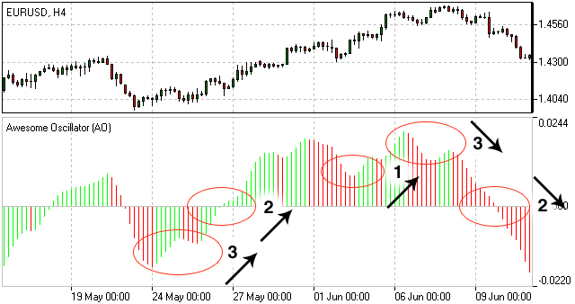

**Awesome Oscillator Trading Strategy**

Awesome Oscillator Strategy includes 3 ways of trading. The first way is to open a sell position when the oscillator is below the zero line forming a peak, and open a buy position when the oscillator is above the zero line forming a gap.

Another way is to open a sell position when the oscillator forms two peaks above the zero line, where the second high is lower than the previous one. And, conversely, traders watch to open a buy position when the oscillator forms to lows below the zero line with the last one not as low as the previous one.

The third way is to account crossing the zero line. When the oscillator crosses it from up to down, it is time to open a sell position and when it crosses from down to up, it is time to open a buy position.

**Awesome Oscillator Formula (Calculation)**

Awesome Oscillator is a 34-period simple moving average, plotted through the central points of the bars (H+L)/2, and subtracted from the 5-period simple moving average, graphed across the central points of the bars (H+L)/2.

.. code::

    MEDIAN PRICE = (HIGH+LOW)/2
    AO = SMA(MEDIAN PRICE, 5)-SMA(MEDIAN PRICE, 34)
    where
    SMA — Simple Moving Average.

Fractals
--------

Fractals is an indicator highlighting the chart’s local heights and lows where the price movement had stopped and reversed. These reversal points are called respectively Highs and Lows.

**How to Use Fractal Indicator**

Bill Williams' Fractals are formed around a group of five consecutive bars the first two of which are successively reaching higher (or diving deeper) and the last two descending lower (or growing higher) with the middle one being the highest (or the lowest) result in the group accordingly.

Buy fractal is an arrow pointing to the top

Sell fractal is an arrow pointing to the bottom

.. image:: ../images/Fractals.jpg
    :align: center

Gator Oscillator(GO)
--------------------

The Gator Oscillator (GO) is a supplement to the Alligator indicator and is used alongside with it showing the absolute degree of convergence/divergence of the Alligator's three SMAs pointing at the Alligator's periods of slumber and awakeness (i.e. trending and non-trending market phases).

**How to Use Gator Oscillator**

Being an oscillator in the form of two histograms built on either side of the naught line, the Gator Oscillator plots the absolute difference between the Alligator’s Jaw and Teeth (blue and red lines) in the positive area and the absolute difference between the Alligator’s Teeth and Lips (red and green lines) in the negative area. The histogram’s bars are colored green if exceeding the previous bar’s volume or red if falling short.

The bars of the extreme values are in tune with the strong trend forces.

The Alligator's activity periods are divided into the following four:

1. Gator awakes - the bars on different sides of the naught line are colored differently.

2. Gator eats - green bars on both sides of the naught line.

3. Gator fills out - single red bar during the "eating" phase.

4. Gator sleeps - the bars on both sides are red

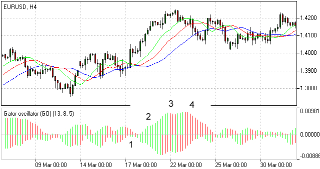

Market Facilitation Index
-------------------------

The Market Facilitation Index is designed for evaluation the willingness of the market to move the price. The indicator's absolute values alone cannot provide any trading signals unlike it's dynamics in relation to the dynamics of the volume.

**How to Use Market Facilitation Index**

The absolute values of the index are represented by the histogram's bars while the comparison of the index and volume dynamics are given in colors which are vital in terms of reading the indicator signs.

Green bar - both MFI and volume are up. Increasing trading activity means market movement acceleration. We may join the trend.

Blue bar - MFI indicator is up, volume is down. The movement is continuing although the volume has dropped. The trend will soon be reversing.

Pink bar - MFI indicator is down, volume is up. The slowing down movement while volume is raising may indicate a possible break through, often a U-turn.

Brown bar - both MFI and volume are down. The market is no longer interested in the current direction and is looking for signs of a future development.

.. image:: ../images/MarketFacilitationIndex.jpg
    :align: center

**Market Facilitation Index Formula (Calculation)**

.. code::

    BW MFI = (HIGH-LOW)/VOLUME

Oscillator
===========

RSI Bar
-------

RSI-Bars is an oscillator, developed by IFC Markets in 2014 as the modification of Relative Strength Index (RSI). RSI-Bars characterizes a stability of a price momentum and allows a definition of a trend potential. 
A distinctive feature of RSI-Bars is that this indicator takes into account the volatility of a considered instrument within the selected timeframe - values of RSI-Bars are defined with account of price OPEN/HIGH/LOW/CLOSE (OHLC) values and are displayed in the form of chart bars. This allows avoiding of false breakdowns of oscillator trend lines and that’s why traders may use methods of a chart analysis more efficiently in this case.

`Download RSI-Bars for Metatrader 4 <http://www.ifcmarkets.com/uploads/RSI-B.zip>`_

Installation guide:

.. code::

    Download and extract the zip archive with indicator file .ex4;
    Open the data directory from the main menu of Metatrader 4 terminal:File =>Open Data Folder;
    Put an indicator file into the folder MQL4/Indicators of Data Folder;
    Restart the Metatrader 4 terminal;
    In order to insert an indicator, open the group of custom indicators in the main menu: Insert=>Indicators=>Custom indicator.

**Advantages of RSI-Bars oscillator**

In contrast to the classical Relative Strength Index, developed by J.Wilder, RSI-Bars evaluates an internal volatility. Minimal and maximum limits of bars are constructed on the basis of 4 prices (OHLC). A calculated set is used for the selection of a minimum and maximum value of RSI-Bars. Then a bar structure is formed.

.. image:: ../images/rsiformula.jpg
    :align: center

An analysis of a candlestick price chart in some cases allows avoiding of a trend false breakdowns. It happens due to the account of additional price information and it internal volatility. At the same way RSI-Bars takes into account a true range of price oscillations, not only a characteristic value of a given timeframe. Due to this property, RSI-Bars allows a correct and convenient use of a chart technical analysis. 

A comparative analysis of RSI and RSI-Bars is represented on the figure below – we used H4 candlesticks of a most volatile pair, GBP/USD. As it can be seen, RSI(14) has shown and additional breakdown in contrast with RSI-Bars (14). Moreover, RSI-Bars has detected later and therefore more correct finishing of a downtrend. 

The use of RSI-Bars is demonstrated in trade examples of everyday analytics releases of IFC Markets.

.. image:: ../images/RSI-Bars.png
    :align: center

**Application**

The oscillator works most efficiently in a flat motion. A lower and higher bounds of oscillator values are introduced subjectively (for example 30% and 70%) and correspond to overbought and oversold levels;

- RSI-Bars can take extreme values during a trend motion. That’s why in this case a use of overbought and oversold levels is incorrect;

- RSI-Bars allows a definition of standard chart analysis instruments - figures, lines of support and resistance, etc. In this case the indicator should be used for a confirmation of technical analysis. We should take into account that RSI-Bars can give preliminary signals of a trend change;

- Divergence is the strongest signal of RSI-Bars – opposite directions of price and oscillator movements are detected in this case. This signal is a harbinger of a possible trend weakening;

- Values of RSI-Bars lie between 0% and 100%.

Average True Range(ATR)
-----------------------

The Average True Range (ATR) indicator was introduced by Welles Wilder as a tool to measure the market volatility and volatility alone leaving aside attempts to indicate the direction. Unlike the True Range, the ATR also includes volatility of gaps and limit moves. ATR indicator is good at valuating the market's interest in the price moves for strong moves and break-outs are normally accompanied by large ranges.

**How to Use ATR Indicator**

The ATR is used with 14 periods with daily and longer timeframes and reflects the volatility values that are in relation to the trading instrument's price. Low ATR values would normally correspond to a range trading while high values may indicate a trend breakout or breakdown.
Average True Range Indicator

.. image:: ../images/AverageTrueRange.jpg
    :align: center

**Average True Range Formula (ATR Calculation)**

Average True Range is a moving average of the True Range which is the greatest of the following three values:

- The distance from today's high to today's low.
- The distance from yesterday's close to today's high.
- The distance from yesterday's close to today's low.

Bollinger Bands
---------------

The Bollinger Bands indicator (named after its inventor) displays the current market volatility changes, confirms the direction, warns of a possible continuation or break-out of the trend, periods of consolidation, increasing volatility for break-outs as well as pinpoints local highs and lows.

**How to Use Bollinger Bands**

The indicator consists of the three moving averages:

- Upper band - 20-day simple moving average (SMA) plus double standard price deviation.

- Middle band - 20-day SMA.

- Lower band - 20-day SMA minus double standard price deviation.

The increasing distance between the upper and the lower bands while volatility is growing, suggests of a price developing in a trend which direction correlates with the direction of the Middle line. In contrast to the above, at times of decreasing volatility when the bands are closing in, we should be expecting the price to move sidewards in a range.

The price moving outside the Bands may indicate either the trend’s continuation (when the bands are floating apart as the volatility increases) or the U-turn of the trend if the initial movement is exhausted. Either way each of the scenarios must be confirmed by other indicators such as RSI, ADX or MACD.
Anyhow the price crossing of the Middle line from below or above may be interpreted as a signal to buy or to sell respectively.

.. image:: ../images/BollingerBands.jpg
    :align: center

**Bollinger Bands Trading Strategy**

Bollinger Bands trading strategy aims to profit from oversold or overbought conditions on the market. Prices are considered overextended on the upside when they touch the upper band (overbought). They are overextended on the downside, when they touch the lower band (oversold). This strategy is used as an immediate signal to buy or sell the security. The usage of upper and lower bands as price targets is referred to as the simplest way of using Bollinger Bands strategy. If prices cross below the average, the lower band becomes the lower price target. If the prices cross above the same average, the upper band identifies the upper price target.

In a Bollinger Band trading system an uptrend is shown by prices fluctuating between upper and middle bands. In such cases if prices cross below the middle band, this warns of a trend reversal to the downside indicating a sell signal.

In a downtrend, prices fluctuate between middle and lower bands, and the price crossing above the middle band warns of a trend reversal to the upside, indicating a buy signal.

**Bollinger Bands Formula (Calculation)**

.. code::

    The middle line (ML) is a regular Moving Average:
    ML = SUM [CLOSE, N]/N
    The top line (TL) is ML a deviation (D) higher:
    TL = ML + (D*StdDev)
    The bottom line (BL) is ML a deviation (D) lower.
    BL = ML — (D*StdDev)
    Where:
    N — number of periods used in calculation;
    SMA — Simple Moving Average;
    StdDev — Standard Deviation.

Commodity Channel Index(CCI)
----------------------------

The Commodity Channel Index is an indicator by Donald Lambert. Despite the original purpose to identify new trends, it’s nowadays widely used to measure the current price levels in relation to the average one.

**How to Use CCI Indicator**

Commodity Channel Index indicator oscillates around the naught line tending to stay within the range from -100 to +100. The naught line represents the level of an average balanced price. The higher the indicator surges above the naught line the more overvalued the security is. The further the CCI indicator plunges into the negative area the more potential for growth the price may have.

Still the unbalanced price alone may not serve as a clear indicator neither to the direction the price is following nor to its strength. There are critical values and the crossing directions which need to be looked at closely:

- Exceeding past the 100 level suggests a possible further upward movement

- Decreasing past the 100 level indicates a U-turn and serves as a signal to sell.

- Decreasing past the -100 level suggests a possible further downward movement

- Exceeding past the -100 level indicates a U-turn and serves as a signal to buy.

- Crossing the naught line upwards from below serves as a confirmation to buy

- Crossing the naught line downwards from above serves a confirmation to sell.

Smaller CCI indicator period increases its sensitivity. Shifting critical levels to 200 allows to exclude insignificant price fluctuations.

.. image:: ../images/CommodityChannelIndex.jpg
    :align: center

**CCI Trading Strategy**

CCI trading strategy is used by most traders, investors and chartists as an overbought or oversold oscillator. The basic strategy of CCI is to watch the readings above +100 and below -100. The readings above +100 are considered overbought and generate buy signals. The readings below -100 are considered oversold and generate sell signals. Though the Commodity Channel Index was initially developed for commodities, it is also used for trading stock index futures and options.

DeMarker(DeM)
-------------

This indicator was introduced by Tom DeMark as a tool to identify emerging buying and selling opportunities. It demonstrates the price depletion phases which usually correspond with the price highs and bottoms.

The DeMarker indicator proved to be efficient at identifying trend break-downs as well as spotting intra-day entry and exit points.

**How to Use DeMarker Indicator**

The indicator fluctuates with a range between 0 to 1 and is indicative of lower volatility and a possible price drop when reading 0.7 and higher, and signals a possible price increase when reading below 0.3.

.. image:: ../images/DeMarker.jpg
    :align: center

**DeMarker Indicator Formula (Calculation)**

The DeMarker indicator is the sum of all price increment values recorded during the "i" period divided by the price minima:

.. code::

    The DeMax(i) is calculated:
    If high(i) > high(i-1) , then DeMax(i) = high(i)-high(i-1), otherwise DeMax(i) = 0
    The DeMin(i) is calculated:
    If low(i) < low(i-1), then DeMin(i) = low(i-1)-low(i), otherwise DeMin(i) = 0
    The value of the DeMarker is calculated as:
    DMark(i) = SMA(DeMax, N)/(SMA(DeMax, N)+SMA(DeMin, N))

Envelopes
---------

The Envelopes indicator reflects the price overbought and oversold conditions helping to identify the entry or exit points as well as possible trend break-downs.

**How to Use Envelopes Indicator**

The Envelopes indicator consists of two SMAs that together form a flexible channel in which the price evolves. The averages are plotted around a Moving Average in a constant percentage distance which may be adjusted according to the current market volatility. Each line serves as a margin of the price fluctuation range.

In a trending market take only oversold signals in an uptrend conditions and overbought signals in a downtrend conditions.

In a ranging market the price reaching the top line serves as a sell signal, while the price at the lower line generates a signal to buy.

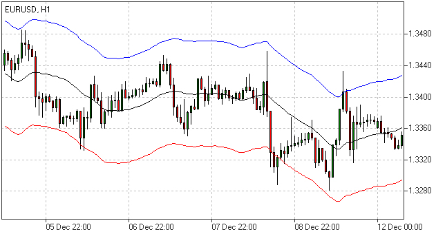

**Envelopes Indicator Formula (Calculation)**

.. code::

    Upper Band = SMA(CLOSE, N)*[1+K/1000]
    Lower Band = SMA(CLOSE, N)*[1-K/1000]
    Where: 
    SMA — Simple Moving Average;
    N — averaging period;
    K/1000 — the value of shifting from the average (measured in basis points).

Force Index
------------

The Force Index indicator invented by Alexander Elder measures the power behind every price move based on their three essential elements, e.g., direction, extent and volume. The oscillator fluctuates around the zero, i.e., a point of a relative balance between power shifts.

**How to Use Force Index**

The Force Index allows to identify the reinforcement of different time scale trends:

- The indicator should be made more sensitive by decreasing its period for short trends.

- The indicator should be smoothed by increasing its period for longer trends.

The Force Index may strongly imply a trend change:

- Break-down of an uptrend when the indicator's value is changing from positive to negative and price and indicator show divergence.

- Break-down of a downtrend when the indicator's value is changing from negative to positive and price and indicator show convergence.

Together with a trend-following indicator the Force Index can help identify trend corrections:

- An uptrend correction when the indicator bounces off the low.

- A downtrend correction when the indicator slides from a pike.

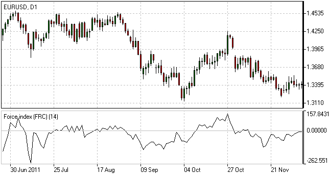

**Force Index Formula (Calculation)**

.. code::

    Force Index(1) = {Close (current period) - Close (prior period)} x Volume
    Force Index(13) = 13-period EMA of Force Index(1)

Ichimoku
---------

The Ichimoku Kinko Hyo (Equilibrium chart at a glance) is a comprehensive technical analysis tool introduced in 1968 by Tokyo columnist Goichi Hosoda. The concept of the system was to provide an immediate vision of trend sentiment, momentum and strength at a glance perceiving all the Ichimoku's five components and a price in terms of interactions among them of a cyclical type related to that of human group dynamics.

**How to Use Ichimoku Indicator**

The Ichimoku indicator consists of five lines which may all serve as flexible support or resistance lines, whose crossovers may as well be assumed as additional signals:

1. Tenkan-Sen (Conversion line, blue)

2. Kijun-Sen (Base line, red)

3. Senkou Span A (Leading span A, green boundary of the cloud)

4. Senkou Span B (Leading span B, red boundary of the cloud)

5. Chikou Span (Lagging span, green)

Kumo (Cloud) is a central element of the Ichimoku system and represents support or resistance areas. It is formed by Leading Span A and Leading Span B.

Determining the trend persistence and corrections:

- Price moving above the cloud indicates an uptrend

- Price moving below the cloud indicates a downtrend

- Price moving within the cloud indicates a sideways trend

- Cloud turning from green to red indicates a correction during an uptrend

- Cloud turning from red to green indicates a correction during a downtrend

Determining support and resistance:

- Leading span A serves as a first support line for an uptrend

- Leading span B serves as a second support line for an uptrend

- Leading span A serves as a first resistance line for a downtrend

- Leading span B serves as a second resistance line for a downtrend

Strong Buy/Sell signals occurring above the cloud:

- Conversion line crosses Base line up from below is a signal to buy

- Conversion line crosses Base line down from above is a signal to sell

Less reliable Buy/Sell signals occurring within the cloud:

- Conversion line crosses Base line up from below is a signal to buy

- Conversion line crosses Base line down from above is a signal to sell

.. image:: ../images/Ichimoku.jpg
    :align: center

**Ichimoku Trading Strategy**

Traders use the Ichimoku strategy to identify the trend. For a bullish signal this trading strategy sets three criteria. First, the trend is bullish when prices reach above the lowest line of the cloud. Second, a bullish signal triggers when prices reverse and reach above the Conversion Line. And third, the trend is bullish when the price moves below the Base Line.

**Ichimoku Formula (Ichimoku Kinko Hyo Calculation)**

.. code::

    Tenkan-Sen (Conversion line, blue) is 
    (9-period high + 9-period low)/2

    Kijun-Sen (Base line, red) is 
    (26-period high + 26-period low)/2

    Senkou Span A (Leading span A, green boundary of the cloud) is 
    (Conversion Line + Base Line)/2

    Senkou Span B (Leading span B, red boundary of the cloud) is 
    (52-period high + 52-period low)/2

    Chikou Span (Lagging span, green) is 
    close price plotted 26 periods in the past

MACD
----

Moving-Average Convergence/Divergence Oscillator, commonly referred to as MACD indicator, is developed by Gerald Appel which is designed to reveal changes in the direction and strength of the trend by combining signals from three time series of moving average curves.

**How to Use MACD Indicator**

Three main signals generated by the MACD indicator (blue line) are crossovers with the signal line (red line), with the x-axis and divergence patterns.

Crossovers with the signal line:

- If the MACD line is rising faster than the Signal line and crosses it from below, the signal is interpreted as bullish and suggests acceleration of price growth;

- If the MACD line is falling faster than the Signal line and crosses it from above, the signal is interpreted as bearish and suggests extension of price losses;

Crossovers with the x-axis:

- A bullish signal appears if the MACD line climbs above zero;

- A bearish signal presents if the MACD line falls below zero.

Convergence/Divergence:

- If the MACD line is trending in the same direction as the price, the pattern is known as convergence, which confirms the price move;

- If they move in opposite directions, the pattern is divergence. For example, if the price reaches a new high, but the indicator does not, this may be a sign of further weakness.

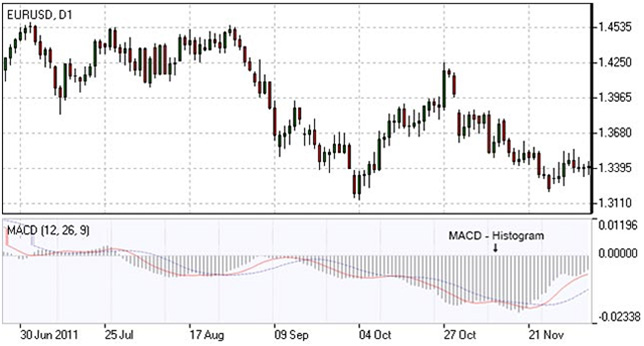

**MACD Indicator Formula (MACD Calculation)**

.. code::

    MACD line = 12-period EMA – 26-period EMA
    Signal line = 9-period EMA
    Histogram = MACD line – Signal line

Momentum
---------

Momentum Oscillator is an indicator that shows trend direction and measures how quickly the price is changing by comparing current and past prices.

**How to Use Momentum Indicator**

The indicator is represented by a line, which oscillates around 100. Being an oscillator, momentum should be used within price trend analysis.

Crossing the x-axis:

- It is believed that if the indicator climbs above 100 during an uptrend, it is a bullish signal;

- Otherwise if the indicator falls below 100 during a downtrend, a bearish signal appears.

Falling out of its normal range:

- Extreme points mean that the price has posted its strongest gain or loss for a particular number of moving periods, supporting trend strength;

- At the same time if the price movement was too rapid, they may indicate possible overbought and oversold areas.

Divergence patterns:

- If the price hits a new high, but the indicator does not, that could mean that investor sentiment is actually lower;
  
- And on the contrary if the price falls to a new low, but the indicator does not support the drop, it is a signal that the trend may end soon.

.. image:: ../images/Momentum.jpg
    :align: center

**Momentum Indicator Formula (Calculation)**

.. code::

    Momentum = (Current close price / Lagged close price) x 100

Relative Vigor Index(RVI)
-------------------------

Relative Vigor Index, developed by John Ehlers, is a technical indicator designed to determine price trend direction. The underlying logic is based on the assumption that close prices tend to be higher than open prices in a bullish environment and lower in a bearish environment.

**How to Use RVI Indicator**

The Relative Vigor Index allows to identify the reinforcement of price changes (and therefore may be used within convergence/divergence patterns analysis):

- Generally the higher the indicator climbs, the stronger is the current relative price increase;

- Generally the lower the indicator falls, the stronger is the current relative price drop.

Together with its signal line (Red), a 4-period moving average of RVI, the indicator (Green) may help to identify changes in prevailing price developments:

- Crossing the signal line from above, the RVI signals a possible sell opportunity;

- Crossing the signal line from below, the RVI signals a possible buy opportunity.

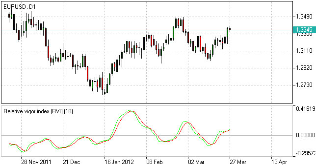

**Relative Vigor Index Formula (RVI Calculation)**

.. code::

    Relative Vigor Index (1) = (Close - Open) / (High - Low)
    Relative Vigor Index (10) = 10-period SMA of Relative Vigor Index (1)

Relative Strenth Index(RSI)
---------------------------

Relative Strength Index is an indicator developed by Welles Wilder to assess the strength or the weakness of the current price movements and to measure the velocity of price changes by comparing price increases with its losses over a certain period.

**How to Use RSI Indicator**

The Relative Strength Index allows to identify possible overbought and oversold areas, but should be considered within trend analysis:

- Generally if the RSI indicator climbs above 70, the asset may be overbought;

- If the RSI indicator drops below 30, the asset may be oversold.

Leaving extreme areas the indicator may suggest possible corrections or even trend changes:

- Crossing the overbought boundary from above, the RSI signals a possible sell opportunity;

- Crossing the oversold boundary from below, the RSI signals a possible buy opportunity.

Convergence/divergence patterns may indicate possible trend weakness:

- If the price climbs to a new high, but the indicator does not, that may be a sign of the uptrend weakness;

- If the price falls to a new low, but the indicator does not, that may be a sign of the downtrend weakness.

.. image:: ../images/RSI.jpg
    :align: center

**RSI Trading Strategy**

RSI trading strategy aims to generate buy and sell signals by the horizontal lines that appear on the chart at the 70 and 30 values. As we have already mentioned above, a move under 30 indicates an oversold condition and a move above 70 signals an overbought condition.

Thus, if a trader is looking for a buying opportunity, he watches the indicator dip under 30. A crossing back above 30 is considered by many traders as a confirmation that the trend has turned up. Conversely, if a trader seeks for a selling opportunity, he watches the indicator cross above the 70 line.

**Relative Strength Index Formula (RSI Calculation)**

.. code::

    RSI = 100 – 100/(1 + RS)
    RS (14) = Σ(Upward movements)/Σ(|Downward movements|)

Stochastic
-----------

Stochastic indicator is introduced by George Lane to identify price trend direction and possible reversal points by determining the place of the current close price in the most recent price range, as in a sustainable uptrend close prices tend to the higher end of the range and to the lower end in a downtrend.

**How to Use Stochastic Oscillator**

The Stochastic oscillator allows to identify possible overbought and oversold areas, but should be considered within trend analysis:

- Generally if the indicator climbs above 75, the asset may be overbought;

- If the indicator drops below 25, the asset may be oversold.

Leaving extreme areas the indicator may suggest possible turning points:

- Crossing the overbought boundary from above, the Stochastic signals a possible sell opportunity;

- Crossing the oversold boundary from below, the Stochastic signals a possible buy opportunity.

Crossovers of the indicator with its smoothened signal line, usually a 3-period moving average, may also detect deal opportunities:

- The indicator suggests going long when crossing the signal line from below;

- The indicator suggests going short when crossing the signal line from above.

Convergence/divergence patterns may indicate possible trend weakness:

- If the price climbs to a new high, but the indicator does not, that may be a sign of the uptrend weakness;

- If the price falls to a new low, but the indicator does not, that may be a sign of the downtrend weakness.

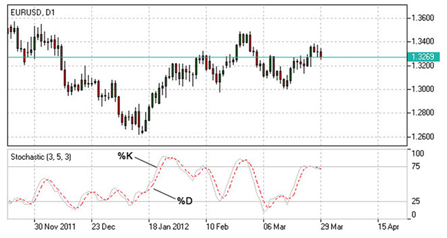

**Stochastic Oscillator Trading Strategy**

Stochastic system is based on the observation that in an uptrend closing prices tend to be near the upper end of the price range, and in a downtrend the closing prices tend to be near the lower end of the price range.

In the Stochastic strategy two lines - the %K line and the %D line – are used. The K line is faster and the D line is slower. These lines oscillate from 0 to 100 on the vertical scale. The major signal to consider is the divergence between the D line and the price of the underlying market. When the D line is over 80 and forms two declining peaks with prices moving higher, a bearish divergence occurs. When the D line is below 20 and forms two rising bottoms with prices moving lower, a bullish divergence takes place. Thus, the actual buy and sell signals are triggered when the K line crosses the D line. A sell signal is generated when the K line crosses below the D line from above the 80 level. Accordingly, a buy signal is generated when the K line crosses above the D line bellow the 20 level.

**Stochastic Oscillator Formula (Calculation)**

.. code::

    Stochastic = 100 x ((C – L)/(H – L));
    Signal = average of the last three Stochastic values;
    where:
    C – latest close price;
    L – the lowest price over a given period;
    H – the highest price over a given period.

Williams Percent Range(WPR,%R)
------------------------------

Williams Percent Range (%R) is a technical indicator developed by Larry Williams to identify whether an asset is overbought or oversold and therefore to determine possible turning points. Unlike the Stochastic oscillator Williams Percent Range is a single line fluctuating on a reverse scale.

**How to Use %R**

The main goal of Williams Percent Range is to identify possible overbought and oversold areas, however the indicator should be considered within trend analysis:

- Generally if the indicator climbs above -20, the asset may be overbought;

- If the indicator drops below -80, the asset may be oversold.

Leaving extreme areas the indicator may suggest possible turning points:

- Crossing the overbought boundary from above, Williams Percent Range signals a possible sell opportunity;

- Crossing the oversold boundary from below, Williams Percent Range signals a possible buy opportunity.

Divergence patterns are rare, but may indicate possible trend weakness:

- If the price climbs to a new high, but the indicator does not, that may be a sign of the uptrend weakness;

- If the price falls to a new low, but the indicator does not, that may be a sign of the downtrend weakness.

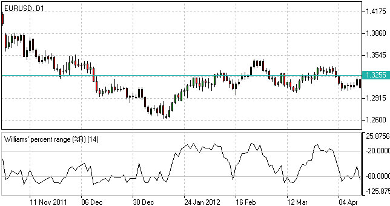

**Williams %R Trading Strategy**

Williams %r indicator, as already mentioned, helps to determine the points when the market is oversold or overbought. The trading rules of %R strategy are simple: buying when the market is oversold (%R reaches -80% or lower) and selling when the market is overbought (%R reaches -20% or higher).

**Williams %R Formula (Calculation)**

.. code::

    R% = - ((H - C)/(H – L)) x 100;
    where:
    C – latest close price;
    L – the lowest price over a given period;
    H – the highest price over a given period.

Trend Indicators
================

Average Directional Index(ADI)
------------------------------

Average Directional Index (ADX) is a technical indicator developed by Welles Wilder to estimate trend strength and determine probable further price movements by comparing the difference between two consecutive lows with the difference between the highs.

**How to Use ADX Indicator**

ADX is a complex indicator, which results from calculation of the Plus Directional Indicator (+DI – green line) and the Minus Directional Indicator (-DI – red line), but all of them may be used for trend analysis.

In general the indicator (bold line) move is believed to reflect current trend strength:

- Rising ADX (usually climbing above 25) suggests strengthening market trend – trend following indicators are becoming more useful;

- Falling ADX suggests the trend development is doubtful. ADX values below 20 may indicate neutral trend is present – oscillators are becoming more useful.

Use of complex ADX trading system may require additional confirmation signals:

- Normally if +DI (green line) climbs above -DI (red line), a buy signal is generated;

- Normally if -DI climbs above +DI, a sell signal is generated.

.. image:: ../images/ADX.jpg
    :align: center

**ADX Trading Strategy**

ADX trading strategy aims to identify the strongest trends and distinguish between trending and non-trending conditions.

ADX reading above 25 indicates trend strength, while when ADX is below 25, this shows trend weakness. Breakouts, which are not difficult to spot, also help to identify whether ADX is strong enough for the price to trend or not. Thus, when ADX rises from below 25 to above 25, trend is considered strong enough to continue in the direction of the breakout.

It’s a common misperception that when ADX line starts falling this is a sign of trend reversal. Whereas, it only means that the trend strength is weakening. As long as ADX is above 25, it should be considered that a falling ADX line is simply less strong.

**ADX Formula (Calculation)**

.. code::

    ADX = MA [((+DI) – (-DI)) / ((+DI) + (-DI))] x 100;
    where:
    +DI – Plus Directional Indicator;
    -DI – Minus Directional Indicator.

Moving Average(MA)
------------------

Moving Average is a technical analysis tool that shows average price over a given period of time, which is used to smoothen price fluctuations and therefore to determine trend direction and strength.

Depending of the method of averaging, distinguish between simple moving average (SMA), smoothed moving average (SMMA) and exponential moving average (EMA).

**How to Use Moving Average**

Generally moving average curves analysis includes the following principles:

- Direction of moving average curve reflects prevailing trend over a period;

- Low-period averaging may give more false signals, while large-period averaging tend to be lagging;

- To increase (decrease) sensitivity of the curve one should decrease (increase) the period of averaging;

- Average curves are more useful in trending environment.

Comparing moving average with price movements:

- A strong buy (sell) signal arise if price crosses from below (from above) its rising (falling) moving average curve;

- A weak buy (sell) signal arise if price crosses from below (from above) its falling (rising) moving average curve.

Comparing moving average curves of different periods:

- A rising (falling) lower-period curve crossing from below (above) another rising (falling) longer-period curve gives a strong buy (sell) signal;

- A rising (falling) lower-period curve crossing from below (above) another falling (rising) longer-period curve gives a weak buy (sell) signal.

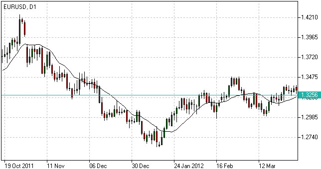

**Moving Average Trading Strategy**

Moving average strategy is essentially a trend following means. Its objective is to signal the beginning of a new trend or a trend reversal. Herein, its main purpose is to track the progress of the trend and not to predict market action in the same sense that technical analysis attempts to do. By its nature, Moving Average is a follower; it follows the market telling that a new trend has begun or reversed only after the fact.

**Moving Average Formula (Calculation)**

.. code::
    
    SMA = Sum (Close (i), N) / N,
    where:
    Close (i) – current close price;
    N – period of averaging.
    EMA(t) = EMA(t-1) + (K x [Close(t) – EMA(t-1)]), 
    where:
    t – current period;
    K = 2 / (N + 1), N – period of averaging.

SMA
---

Generally, the term ''Moving Average'' refers to Simple Moving Average. The latter does not predict price direction; it is a lagging indicator and rather defines the current direction. It is an indicator that shows the average value of the instrument's price over a specified period of time.

**Simple Moving Average Example**

An SMA is calculated by adding the closing price of the instrument to the number of time periods and then dividing the total number by the number of time periods. The result will be the average price of the instrument over a certain time period. Thus, in order to calculate a 10-day SMA, it's necessary to add closing prices over a 10-day period and divide the total number by 10. As the term ''moving'' implies, prices move according to the point on the chart. This means that always a new calculation is needed that can correspond to the time period of the average used. Thus, you can recalculate a 10-day average by adding the new day and missing out the 10th day and so on.

Though simple moving average is used by most traders and analysts, it is criticized by two reasons. The first criticism is that only the time period covered by the average is taken into consideration. And secondly, the SMA gives equal weight to each day's price.

Nevertheless, Simple Moving Average has become a preferred method for tracking prices due to its simplicity and quick calculation. By the same simplicity early market analysts performed the market analysis without using complicated chart metrics that are widely applied today. They mainly relied on market prices as the main means of tracking trends and market direction. This process was boring but was confirmed to be profitable and reliable, and up till now it continues to be a popular technical analysis tool extensively used by most traders.

Moving Average of Oscillator(OsMA)
----------------------------------

Moving Average of Oscillator (OsMA) is a technical analysis tool that reflects the difference between an oscillator (MACD) and its moving average (signal line).

**How to Use OsMa Indicator**

Extremum points:

- OsMA switching from falling to rising in extreme areas may be a sign of bullish reversal;

- OsMA switching from rising to falling may be a sign of bearish reversal.

Crossing zero axis:

- OsMA rising above zero (corresponds to MACD crossing from below its signal line) generates a buy signal;

- OsMA falling below zero (corresponds to MACD crossing from above its signal line) generates a sell signal.

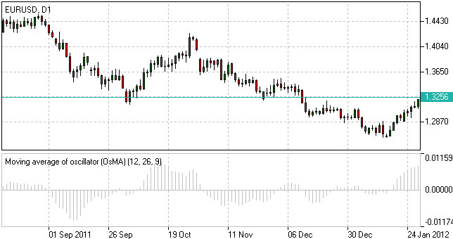

**Moving Average of Oscillator Formula (Calculation)**

.. code::

    OsMA = MACD – Signal

Parabolic(SAR)
--------------

Parabolic is a trend following indicator developed by Welles Wilder and designed to confirm or reject trend direction, to determine trend end, correction or flat stages as well as to indicate possible exit points. The underlying principle of the indicator can be described as “stop and reverse” (SAR).

**How to Use Parabolic SAR**

When using the indicator we should take into consideration its positioning against the price chart as well as its acceleration factor which increases together with the trend. Despite being a popular tool of analysis, it has limitations and may give false signals in frequently changing market conditions.

The indicator may signal the following:

Trend confirmation

- If the indicator is plotted below the price graph, it stands for an uptrend;

- If the indicator is plotted above the price graph, it confirms a downtrend.

Exit points determination

- If the price drops below Parabolic line during an uptrend, there may be sense in closing long positions;

- If the price rises above Parabolic curve during a downtrend, there may be sense in closing short positions.

Signal significance is determined with the use of the acceleration factor. The acceleration factor increases each time the close price is higher than its previous value in an uptrend and lower in a downtrend. It is believed that the indicator is more reliable when the price’s and the indicator’s moves are parallel and less reliable when they converge.

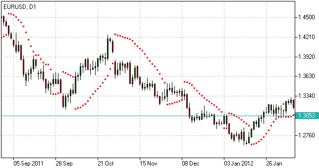

**Parabolic SAR Formula (Calculation)**

.. code::

    P(t) = P(t-1) + AF x (EP(t-1) – P(t-1)),
    where:
    P(t) – current value of the indicator;
    P(t-1) – value in the previous period;
    AF – acceleration factor, generally rising from 0.02 to 0.2 with a step of 0.02;
    EP(t-1) – extreme price in the previous period.

Volume Indicators
=================

Accumulation/Distribution(AD)
-----------------------------

Accumulation/Distribution is a volume-based technical analysis indicator designed to reflect cumulative inflows and outflows of money for an asset by comparing close prices with highs and lows and weighting the relation by trading volumes.

**How to Use Accumulation/Distribution**

The Accumulation/Distribution line is used for trend confirmation or possible turning points identification purposes.

Trend confirmation:

- An uptrend in prices is confirmed if A/D line is rising;

- A downtrend in prices is confirmed if A/D line is falling.

Divergence pattern analysis:

- Rising A/D line along with decreasing prices indicates the downtrend may be weakening to a bullish reversal;

- Falling A/D along with rising prices indicates the uptrend may be weakening to a bearish reversal.

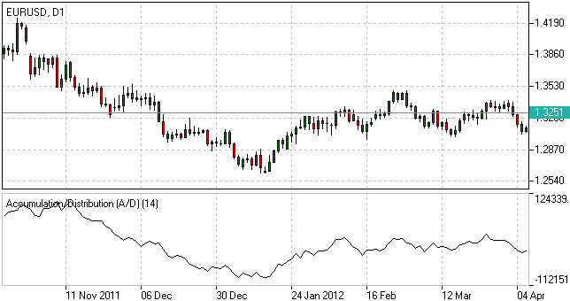

**Accumulation/Distribution Indicator Formula (Calculation)**

.. code::

    A/D(t) = [((C – L) – (H – C)) / (H – L)] x Vol + A/D(t-1),
    where:
    A/D(t) – current Accumulation/Distribution value;
    A/D(t-1) – previous Accumulation/Distribution value;
    H – current high;
    L – current low;
    C – close price;
    Vol – volume.

Money Flow Index(MFI)
---------------------

Money Flow Index (MFI) is a technical indicator developed to estimate money inflow intensity into a certain asset by comparing price increases and decreases over a given period, but also taking into consideration trading volumes.
**How to Use Money Flow Index**

The indicator can be used to identify whether an asset is overbought or oversold, as well as to determine possible turning points.

Analyzing extreme (overbought/oversold) areas:

- If MFI climbs above 80, the asset is generally considered to be overbought. A sell signal appears if MFI crosses the overbought area boundary from above;

- If MFI drops below 20, the asset is generally considered to be oversold. A buy signal appears if MFI crosses the oversold area boundary from below.

Divergence patterns analysis:

- Rising MFI along with decreasing prices indicates the downtrend may be weakening;

- Falling MFI along with rising prices indicates the uptrend may be weakening.

.. image:: ../images/MFI.jpg
    :align: center

**Money Flow Index Formula (Calculation)**

.. code::

    The following steps are required to calculate the index:
    1. TP = (H + L + C) / 3;
    2. MF = TP*Vol;
    3. MR = Sum(MF+) / Sum(MF-);
    4. MFI = 100 – (100 / (1 + MR)),
    where:
    TP – typical price;
    H – current high; 
    L – current low; 
    C – close price; 
    MF – money flow (positive (MF+) if current TP > previous TP, negative (MF-) otherwise); 
    Vol – volume; 
    MR – money ratio.

On-Balance Volume(OBV)
----------------------

On-Balance Volume (OBV) is a cumulative volume-based tool intended to show the relation between the amount of deals and asset’s price movements.

**How to Use On Balance Volume**

The On-Balance Volume line is used for trend confirmation or possible turning points identification purposes.

Trend confirmation:

- An uptrend in prices is confirmed if the line is rising;

- A downtrend in prices is confirmed if the line is falling.

Divergence pattern analysis:

- Rising OBV line along with decreasing prices indicates the downtrend may be weakening to a bullish reversal;

- Falling OBV along with rising prices indicates the uptrend may be weakening to a bearish reversal.

.. image:: ../images/OBV.jpg
    :align: center

**On-Balance Volume Formula (Calculation)**

.. code::

    OBV(t) = OBV(t-1) + Vol, if C(t) > C(t-1);
    OBV(t) = OBV(t-1) – Vol, if C(t) < C(t-1);
    OBV(t) = OBV(t-1), if C(t) = C(t-1),
    where:
    t – current period;
    t-1 – previous period;
    C – close price;
    Vol – volume.

Volumes
-------

Volume indicator is a technical analysis tool, which reflects trading activity of investors for a given time period.

**How to Use Volume Indicator**

Volume indicator is generally used together with price analysis to confirm trend strength or highlight its weakness and therefore identify possible upcoming reversals.

Trend confirmation:

- Rising trading volumes during an uptrend confirms bullish mood;

- Rising trading volumes during a downtrend confirms bearish mood.

Trend weakness:

- If volumes are falling while prices are increasing, that may be a sign of uptrend weakness, as demand for the asset may cease at higher prices.

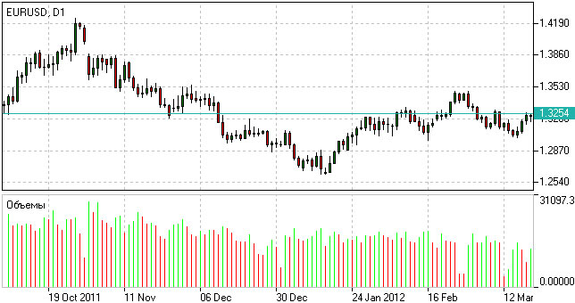

**Forex Volumes Calculation**

.. code::

    Volume = total value/number of transactions during a given period.

-----------------
5.2 自动交易基础
-----------------

笔者编写了一些交易脚本，包括EA和script，可访问https://github.com/lofyer/mt4-scripts进行下载。

-----------------
5.3 基本分析基础
-----------------

央行测量啦、社会指标啦、等等啦啦啦

---------------
5.3 货币选择
---------------

5.3.1. 历史数据
================

5.3.2. 新闻与报告
==================
